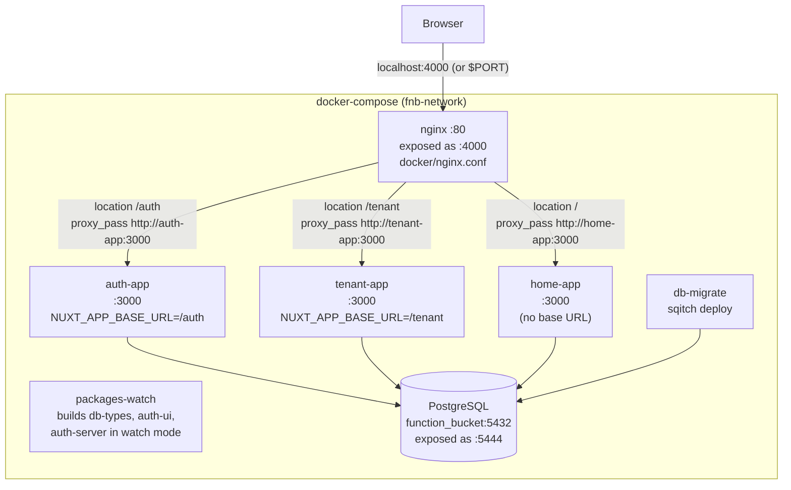
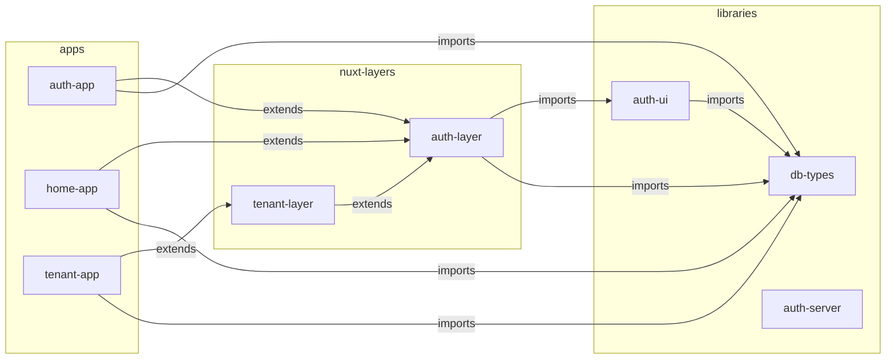
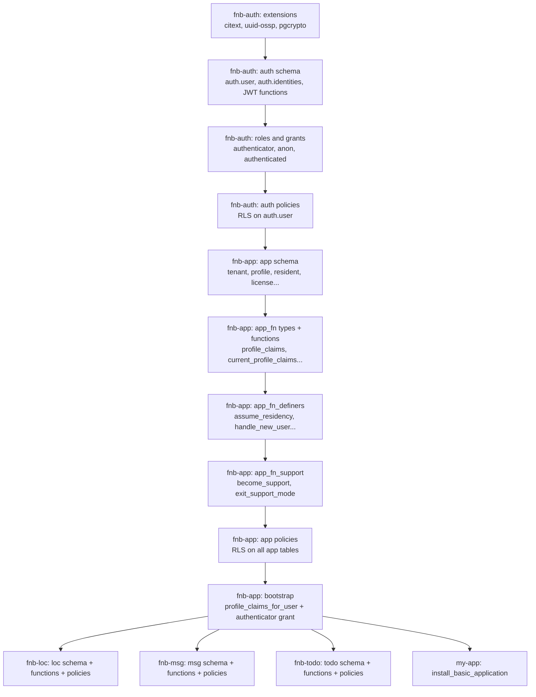

# Architecture Overview

## Monorepo Structure

```
fnb/
├── apps/
│   ├── auth-app/          # Authentication & profile management  →  nginx /auth
│   ├── home-app/          # Landing page & module dashboard      →  nginx /
│   └── tenant-app/        # Tenant & site administration         →  nginx /tenant
├── packages/
│   ├── auth-layer/        # Nuxt layer: shared UI components, composables, layouts
│   ├── tenant-layer/      # Nuxt layer: extends auth-layer for tenant apps
│   ├── auth-ui/           # Compiled library: useAuth() composable
│   ├── auth-server/       # Compiled library: server-side Postgres helpers
│   └── db-types/          # Compiled library: Kysely DB client + Kanel-generated types
├── db/
│   ├── fnb-auth/          # sqitch: auth schema (users, roles, JWT functions)
│   ├── fnb-app/           # sqitch: app schema (tenants, profiles, residents, licensing)
│   ├── fnb-loc/           # sqitch: loc schema (locations)
│   ├── fnb-msg/           # sqitch: msg schema (topics, messages, subscribers)
│   ├── fnb-todo/          # sqitch: todo schema (hierarchical todos with topics)
│   └── my-app/            # sqitch: example custom module
├── docker/
│   ├── nginx.conf         # nginx reverse proxy config (path-based routing)
│   └── migrate.Dockerfile # sqitch migration container
├── scripts/               # TypeScript scripts: db-deploy, db-generate, env-build
├── docker-compose.yml     # Full environment: nginx + apps + db + migrations
├── turbo.json             # Turborepo task pipeline
└── pnpm-workspace.yaml    # Workspace packages: apps/* + packages/*
```

## Tech Stack

| Layer | Technology |
|-------|-----------|
| Framework | Nuxt 4.4.2 (Vue 3, SSR) |
| UI | Nuxt UI 4.6.1 + Tailwind CSS 4.2.2 |
| Language | TypeScript 6.0.2 (strict mode) |
| Database | PostgreSQL (via Docker) |
| DB migrations | sqitch |
| ORM / Query builder | Kysely |
| DB type generation | Kanel |
| Build orchestration | Turborepo |
| Package manager | pnpm workspaces (node ≥ 20, pnpm ≥ 9) |
| Testing | Vitest |
| Linting | ESLint + Prettier (no semis, single quotes, 100-char) |

## Docker & nginx Topology

All services run inside a single Docker Compose environment on a shared `fnb-network`. From outside Docker there is **one entry point**: nginx on port `${PORT:-4000}` (default 4000). Every Nuxt app runs on **port 3000 inside its own container**; nginx routes requests to the right container by URL path prefix.



### Path-based routing (docker/nginx.conf)

```nginx
location /auth    { proxy_pass http://auth-app:3000;    }
location /tenant  { proxy_pass http://tenant-app:3000;  }
location /        { proxy_pass http://home-app:3000;    }
```

nginx also handles **WebSocket upgrade** headers so Vite HMR works through the proxy in development (`Upgrade`, `Connection` headers forwarded; `VITE_HMR_CLIENT_PORT` set to the external port).

### Why all apps run on the same internal port

Each Nuxt app is in its own container — there's no port collision. They all listen on `:3000` internally and are differentiated by their Docker service name (`auth-app`, `tenant-app`, `home-app`). `NUXT_APP_BASE_URL` tells Nuxt what path prefix it's served under so asset URLs and router base are correct.

### Docker services summary

| Service | Image / Build | Role |
|---------|--------------|------|
| `nginx` | `nginx:alpine` | Reverse proxy; single external entry point |
| `auth-app` | monorepo Dockerfile | Nuxt dev server for auth |
| `tenant-app` | monorepo Dockerfile | Nuxt dev server for tenant admin |
| `home-app` | monorepo Dockerfile | Nuxt dev server for home dashboard |
| `db` | `postgis/postgis` | PostgreSQL + PostGIS |
| `db-migrate` | custom Dockerfile | Runs sqitch deploy on startup |
| `pnpm-install` | monorepo Dockerfile | Runs `pnpm install` once (volume-cached) |
| `packages-watch` | monorepo Dockerfile | Builds shared packages in watch mode |

`packages-watch` is a health-checked service — the three app containers wait for it to report healthy (all three `dist/index.js` files exist) before starting.

---

## Application Descriptions

### auth-app
The authentication gateway. Every user authenticates here. Served at `/auth` (e.g. `localhost:4000/auth`). Other apps redirect here for login. After login, two cookies are set that all apps share (same domain, so all paths can read the `auth.user` cookie).

**Routes:**
- `/` — landing (shows profile if logged in)
- `/login` — login form
- `/profile` — edit profile, change password
- `/current-profile-claims` — debug: shows full JWT claims object

**Key server files:**
- `server/api/auth/login.post.ts` — authenticates, sets cookies
- `server/api/auth/logout.post.ts` — clears cookies
- `server/_common/get-h3-event-claims.ts` — session → DB → claims
- `server/middleware/auth.ts` — runs on every request, populates `event.context.claims`

### home-app
The dashboard landing page. Shows available feature modules filtered by the logged-in user's permissions. Acts as a navigation hub.

**Routes:**
- `/` — hero (logged out) or module grid (logged in)

Modules shown are filtered client-side by `user.permissions` from the `auth.user` cookie.

### tenant-app
Multi-tenant administration. Two major sections with different permission requirements:

**Admin section** (`p:app-admin`) — Tenant admins manage their own tenant:
- `/admin/` — admin dashboard
- `/admin/user` — resident list
- `/admin/user/[id]` — resident detail + license assignment
- `/admin/license` — all licenses (filter by type/status/resident)
- `/admin/subscription` — tenant subscription list

**Site Admin section** (`p:app-admin-super`) — Platform super admins manage everything:
- `/site-admin/tenant` — all tenants
- `/site-admin/tenant/[id]` — edit tenant, activate/deactivate
- `/site-admin/user` — all users (profiles)
- `/site-admin/user/[id]` — user detail, manage residencies
- `/site-admin/application` — all applications
- `/site-admin/application/[key]` — application detail with modules + license types

## Package Dependency Graph



## Nuxt Layer Inheritance

Nuxt 4 "layers" allow one Nuxt config to extend another, merging components, composables, pages, layouts, and plugins.

```
auth-layer
  ├── layouts/default.vue          ← header + sidebar nav + main slot
  ├── components/
  │   ├── AppNav.vue               ← slide-over sidebar
  │   ├── AppLogo.vue              ← ƒb SVG logo
  │   ├── LoginForm.vue
  │   ├── UserProfile.vue
  │   ├── UserProfileStatus.vue    ← avatar + name + logout
  │   ├── ChangePasswordForm.vue
  │   └── ModuleNavSection.vue     ← collapsible nav section
  ├── composables/
  │   ├── useAuth.ts               ← re-exports from auth-ui
  │   ├── useAppNav.ts             ← nav open/close + permission filtering
  │   └── useNavRegistry.ts        ← global nav section registry (useState)
  └── plugins/
      └── nav-register.ts          ← registers admin/super-admin/support nav sections

tenant-layer (extends auth-layer)
  └── plugins/
      └── nav-register.ts          ← can register tenant-specific sections

auth-app (extends auth-layer)
  └── pages/, server/api/, server/middleware/

home-app (extends auth-layer)
  └── pages/

tenant-app (extends tenant-layer → auth-layer)
  └── pages/, components/, server/api/, server/middleware/
```

## Database Package Deployment Order

Sqitch packages have explicit dependencies. Deployment order:



## Root Scripts

```bash
pnpm dev          # turbo run dev (all apps in parallel)
pnpm build        # turbo run build (respects dependency order)
pnpm test         # turbo run test (after build)
pnpm lint         # turbo run lint
pnpm format       # prettier --write

pnpm db-start     # docker-compose up postgres
pnpm db-stop      # docker-compose down
pnpm db-deploy    # sqitch deploy all packages
pnpm db-rebuild   # drop + redeploy from scratch
pnpm db-generate  # kanel: regenerate TypeScript types from DB schema
pnpm db-status    # sqitch status
pnpm db-psql      # psql interactive shell
```
