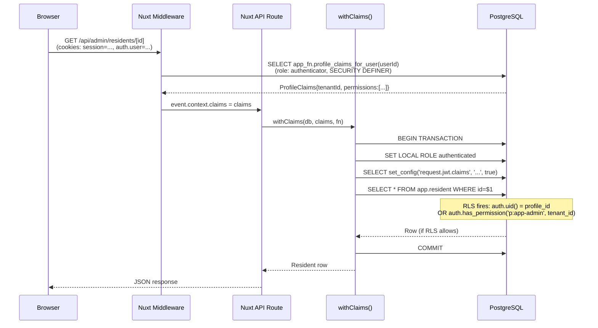

# Full Stack — DB to UI

Every user-visible feature in fnb passes through six distinct layers. This document traces each layer and shows how they connect.

---

## Layer Stack

```
┌─────────────────────────────────────────────┐
│  Layer 6: Vue Components & Pages            │
│  apps/*/pages/, apps/*/components/          │
├─────────────────────────────────────────────┤
│  Layer 5: Composables                       │
│  packages/auth-ui/src/use-auth.ts           │
│  packages/auth-layer/app/composables/       │
├─────────────────────────────────────────────┤
│  Layer 4: Nuxt Server API Routes            │
│  apps/*/server/api/**/*.ts                  │
├─────────────────────────────────────────────┤
│  Layer 3: Nuxt Server Middleware            │
│  apps/*/server/middleware/auth.ts           │
│  apps/*/server/_common/get-h3-event-claims  │
├─────────────────────────────────────────────┤
│  Layer 2: db-types Package                  │
│  packages/db-types/src/                     │
│  (Kysely queries, mutations, withClaims)    │
├─────────────────────────────────────────────┤
│  Layer 1: PostgreSQL                        │
│  schemas: auth, app, app_fn, app_api        │
│  RLS policies on every table                │
└─────────────────────────────────────────────┘
```

---

## Layer 1: PostgreSQL Schemas

Each module uses a three-schema pattern:

| Schema | Purpose | Who calls it |
|--------|---------|--------------|
| `auth` | Users, credentials, JWT helper functions | db-types mutations, RLS policies |
| `app` | Core tables (tenant, profile, resident, license…) | Kysely queries directly |
| `app_fn` | Business logic functions (SECURITY DEFINER) | API routes via db-types mutations |
| `app_api` | PostGraphile-exposed API functions; permission enforcement | PostGraphile or direct SQL |
| `<module>` | Module tables (e.g. `msg`, `todo`, `loc`) | Kysely queries |
| `<module>_fn` | Module business logic (SECURITY DEFINER) | db-types mutations |
| `<module>_api` | Module API surface (enforces `p:discussions` etc.) | PostGraphile |

**RLS is on every data table.** Policies read from `current_setting('request.jwt.claims')` via helper functions like `auth.uid()`, `auth.tenant_id()`, `auth.has_permission()`.

### Key JWT Helper Functions (auth schema)

```sql
auth.uid()           -- returns profile_id from JWT (for profile/resident RLS)
auth.jwt()           -- returns parsed JSON of request.jwt.claims
auth.tenant_id()     -- extracts tenant_id from JWT user_metadata
auth.resident_id()   -- extracts resident_id
auth.profile_id()    -- extracts profile_id
auth.email()         -- extracts email
auth.permissions()   -- returns permissions citext[] from JWT
auth.has_permission(key)              -- checks permissions array
auth.has_permission(key, tenant_id)   -- tenant-scoped check
auth.enforce_permission(key)          -- raises exception if missing
```

---

## Layer 2: db-types Package

`packages/db-types/` is the bridge between TypeScript and PostgreSQL.

### Sub-directories

```
packages/db-types/src/
├── db.ts                    # createDb(connectionString) → Kysely instance
│                            # Uses CamelCasePlugin (snake_case DB ↔ camelCase TS)
├── with-claims.ts           # withClaims(db, claims, fn) — RLS transaction wrapper
├── generated/               # Kanel-generated TypeScript types (run: pnpm db-generate)
│   ├── fnb-auth/auth/       # AuthUser, AuthIdentity types
│   └── fnb-app/             # Profile, Resident, Tenant, License, etc.
│       ├── app/             # Table row types
│       └── app_fn/          # Function param/return types (ProfileClaims, etc.)
├── queries/                 # Read-only Kysely query helpers
│   ├── tenant.ts            # selectAllTenants, selectTenantById, updateTenant
│   ├── profile.ts           # selectAllProfiles, selectProfileById, ...
│   ├── resident.ts          # selectResidentsByTenantId, selectResidentById, ...
│   ├── license.ts           # selectLicensesByResidentId, ...
│   ├── subscription.ts      # selectSubscriptionsByTenantId, ...
│   └── application.ts       # selectAllApplications, selectApplicationByKey, ...
└── mutations/               # Write operations (call SQL functions)
    ├── fnb-auth/
    │   └── login-user.ts    # authFn.loginUser(db, email, password)
    └── fnb-app/
        ├── app_fn/
        │   ├── profile-claims-for-user.ts  # appFn.profileClaimsForUser(db, userId)
        │   └── current-profile-claims.ts   # appFn.currentProfileClaims(db, profileId)
        └── app_api/
            ├── grant-user-license.ts
            ├── revoke-license.ts
            ├── block-resident.ts
            ├── activate-tenant.ts
            └── ... (many more)
```

### withClaims — The Critical Bridge

```typescript
// packages/db-types/src/with-claims.ts
export async function withClaims<T>(
  db: Kysely<Database>,
  claims: ProfileClaims,
  fn: (trx: Transaction<Database>) => Promise<T>,
): Promise<T> {
  const payload = JSON.stringify(buildJwtPayload(claims))
  return db.transaction().execute(async (trx) => {
    await sql`set local role authenticated`.execute(trx)
    await sql`select set_config('request.jwt.claims', ${sql.val(payload)}, true)`.execute(trx)
    return fn(trx)
  })
}
```

Every API route that reads protected data wraps its Kysely queries in `withClaims`. This:
1. Starts a Postgres transaction
2. Switches the session role from `authenticator` to `authenticated` — RLS now fires
3. Injects the user's claims into the Postgres session config
4. Runs the application query — RLS policies read `current_setting('request.jwt.claims')` to decide what rows to show

---

## Layer 3: Nuxt Server Middleware

Runs before every API route. Reads the `session` cookie, fetches fresh claims from DB, and attaches them to `event.context`.

```typescript
// apps/auth-app/server/_common/get-h3-event-claims.ts
async function getH3EventClaims(event: H3Event) {
  const raw = getCookie(event, 'session')
  const session = raw ? JSON.parse(raw) : undefined
  const user = session?.id ? { id: session.id } : undefined

  if (user) {
    // Calls app_fn.profile_claims_for_user() — SECURITY DEFINER, no claims needed
    const claims = await appFn.profileClaimsForUser(event.context.db, user.id)
    event.context.claims = claims
    return { user, claims }
  }
  return { user: undefined, claims: undefined }
}
```

Note: `profile_claims_for_user` is callable by the `authenticator` role WITHOUT claims set, because it's `SECURITY DEFINER` (runs as postgres) and has been explicitly granted to `authenticator`. This is the **bootstrap** step — claims don't exist yet, so we can't use `withClaims`.

---

## Layer 4: Nuxt Server API Routes

API routes check for claims, then use `withClaims` for any protected query.

**Pattern for a protected read:**
```typescript
// apps/tenant-app/server/api/admin/residents/[id].get.ts
export default defineEventHandler(async (event) => {
  const { claims, db } = event.context
  if (!claims) throw createError({ statusCode: 401 })

  const id = getRouterParam(event, 'id')
  const resident = await withClaims(db, claims, (trx) =>
    selectResidentById(trx, id)
  )
  return resident
})
```

**Pattern for a protected mutation:**
```typescript
// apps/tenant-app/server/api/admin/residents/[id]/licenses/grant.post.ts
export default defineEventHandler(async (event) => {
  const { claims, db } = event.context
  if (!claims) throw createError({ statusCode: 401 })

  const { licenseTypeKey } = await readBody(event)
  const license = await withClaims(db, claims, (trx) =>
    appApi.grantUserLicense(trx, residentId, licenseTypeKey)
  )
  return license
})
```

The `withClaims` call ensures:
- The database role is `authenticated` (RLS fires)
- The user's `tenant_id`, `permissions`, etc. are in the session config
- If the RLS policy denies the row, Kysely returns nothing (or throws, depending on the operation)

---

## Layer 5: Composables

### useAuth (packages/auth-ui)

The foundational composable. Available in every app via the auth-layer.

```typescript
const {
  user,          // Ref<ProfileClaims | null> — from 'auth.user' cookie
  isLoggedIn,    // Computed<boolean>
  fetchUser,     // () => GET /api/current-profile-claims (refreshes from DB)
  login,         // (email, password) => POST /api/auth/login
  logout,        // () => POST /api/auth/logout
  changePassword // (current, newPwd) => POST /api/auth/change-password
} = useAuth()
```

`user` is populated from the `auth.user` cookie (not httpOnly — readable by JavaScript). The server re-fetches fresh claims on every request from the `session` cookie (httpOnly).

### useAppNav (packages/auth-layer)

Manages the slide-over navigation sidebar.

```typescript
const {
  navOpen,       // Ref<boolean>
  toggleNav,     // () => void
  openNav,       // () => void
  closeNav,      // () => void
  availableSections  // ComputedRef — nav sections filtered by user.permissions
} = useAppNav()
```

`availableSections` filters the registered nav sections against the current user's permissions array. A nav section with `permissionKey: 'p:app-admin'` only shows if `user.value.permissions` contains `'p:app-admin'`.

### useNavRegistry (packages/auth-layer)

Global state for registered navigation sections. Apps add sections via the nav-register plugin at startup.

```typescript
const { register, sections } = useNavRegistry()

// In a plugin (nav-register.ts):
register([
  {
    title: 'Admin',
    permissionKey: 'p:app-admin',
    items: [
      { label: 'Users', route: '/admin/user', icon: 'i-lucide-users' },
      { label: 'Licenses', route: '/admin/license', icon: 'i-lucide-key' },
    ]
  }
])
```

---

## Layer 6: Vue Components & Pages

Pages are in `apps/*/pages/`. Components are in `apps/*/components/` and `packages/auth-layer/app/components/`.

**Typical page pattern:**

```vue
<script setup lang="ts">
const { data: residents } = await useFetch('/api/admin/residents')
</script>

<template>
  <UCard>
    <ResidentList :residents="residents" />
  </UCard>
</template>
```

Pages use Nuxt's `useFetch` / `$fetch` to call server API routes. The auth middleware runs automatically via the `session` cookie on the server side.

### Default Layout (auth-layer)

Every page is wrapped in `layouts/default.vue`:

```
┌─ Header (border-b) ──────────────────────────────┐
│  [≡] Menu  [ƒb Logo]          [Avatar + Name ▼]  │
└──────────────────────────────────────────────────┘
│                                                    │
│  [Slide-over AppNav]    <NuxtPage />               │
│  - AdminSection                                    │
│    ├── Users                                       │
│    └── Licenses                                    │
│  - SiteAdminSection                                │
│    ├── Tenants                                     │
│    └── Applications                               │
│                                                    │
```

---

## Request Lifecycle Diagram



---

## Cookie Architecture

Two cookies are set at login and shared across apps (same domain):

| Cookie | `httpOnly` | Contents | Purpose |
|--------|-----------|----------|---------|
| `session` | **yes** | `{ id: userId }` (auth.user.id) | Server reads this to fetch fresh claims on each request |
| `auth.user` | no | Full `ProfileClaims` JSON | Client reads this via `useCookie('auth.user')` in useAuth() |

The `auth.user` cookie is the cached profile claims for the browser. The `session` cookie is the source of truth — every server request fetches fresh claims from the DB using it, so permission changes take effect immediately on next request.
