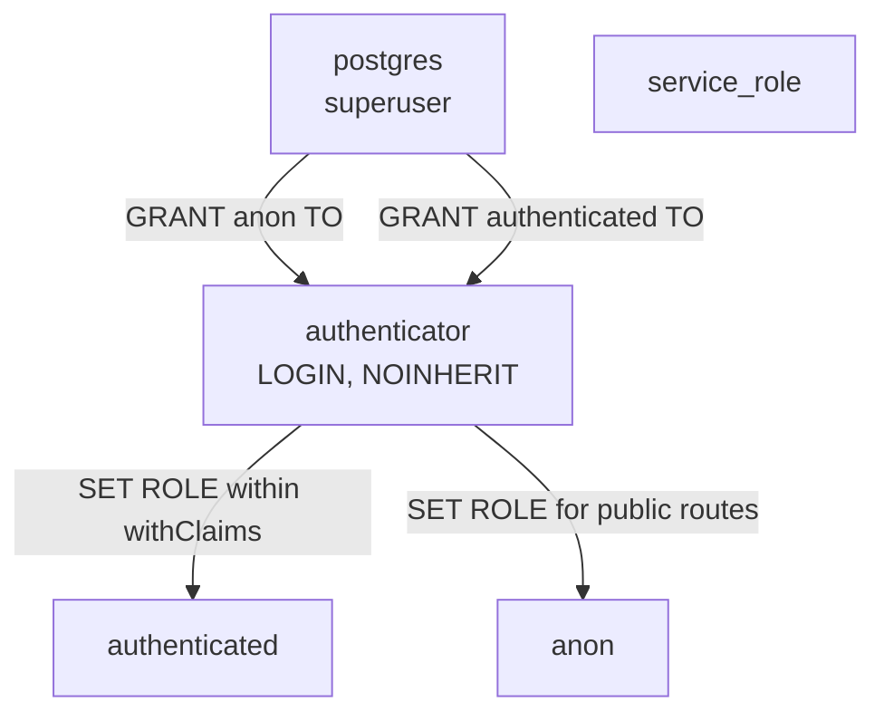
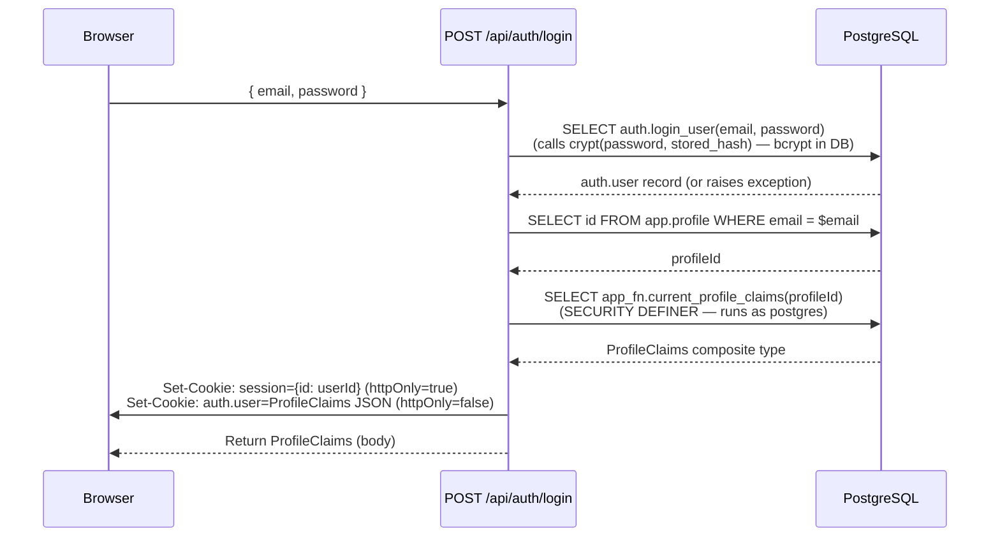
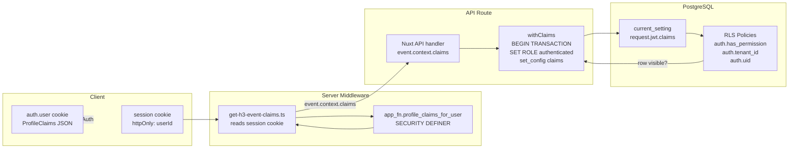

# Security — RLS, withClaims, and the Login Process

## Overview

fnb's security model has three interlocking parts:

1. **Login**: authenticates credentials, builds a claims object, and stamps it into two cookies
2. **Server middleware**: on every request, re-fetches fresh claims from the DB using only the opaque `session` cookie
3. **withClaims + RLS**: every protected query runs inside a Postgres transaction where the user's claims are injected into the session, and Row-Level Security policies enforce authorization at the row level

There is no application-level authorization middleware checking "can this user do X?" — all of that happens in the database.

---

## PostgreSQL Role Model



| Role | Purpose |
|------|---------|
| `postgres` | Superuser; runs SECURITY DEFINER functions |
| `authenticator` | The application's login role. `NOINHERIT` means it gets no permissions from its member roles automatically — it must explicitly `SET ROLE` to use them. This is the role in the Kysely connection string. |
| `authenticated` | The role used inside `withClaims` transactions. Has `USAGE` + `ALL` on every schema. RLS is enforced for this role. |
| `anon` | For public/unauthenticated operations. |
| `service_role` | For background jobs or admin operations that bypass RLS. |

### Why NOINHERIT matters

If `authenticator` inherited permissions from `authenticated`, then any direct query outside a `withClaims` transaction would run with full `authenticated` privileges — and RLS would fire against empty claims (null `tenant_id`, empty `permissions`). `NOINHERIT` prevents this; outside a transaction with `SET ROLE`, `authenticator` has almost no permissions.

---

## Login Flow



### Two cookies

```typescript
// session cookie — opaque user ID, never readable by browser JS
setCookie(event, 'session', JSON.stringify({ id: user.id }), {
  httpOnly: true,
  sameSite: 'lax',
  maxAge: 60 * 60 * 24 * 7,  // 7 days
  secure: process.env.NODE_ENV === 'production',
  domain
})

// auth.user cookie — full claims, readable by browser JS (useAuth)
setCookie(event, 'auth.user', JSON.stringify(claims), {
  httpOnly: false,  // client-readable
  sameSite: 'lax',
  maxAge: 60 * 60 * 24 * 7,
  secure: process.env.NODE_ENV === 'production',
  domain
})
```

The `session` cookie is the server's source of truth. The `auth.user` cookie is a convenience cache for the frontend; it can be stale, but the server always re-derives claims from the DB.

---

## Claims Bootstrap: `profile_claims_for_user` vs `current_profile_claims`

There are two similar functions with an important distinction:

### `app_fn.profile_claims_for_user(user_id uuid)`
- **Called by**: server middleware (before any claims are set)
- **Security**: `SECURITY DEFINER` — runs as `postgres`
- **Granted to**: `authenticator` role explicitly
- **Input**: `auth.user.id` (from the `session` cookie)
- **What it does**: looks up profile via `auth.user.email → app.profile.email`, then calls `current_profile_claims`

```sql
-- db/fnb-app/deploy/00000000010260_app_bootstrap.sql
CREATE OR REPLACE FUNCTION app_fn.profile_claims_for_user(_user_id uuid)
  RETURNS app_fn.profile_claims
  LANGUAGE sql STABLE SECURITY DEFINER AS $$
    SELECT app_fn.current_profile_claims(p.id)
    FROM app.profile p
    JOIN auth.user u ON u.email = p.email
    WHERE u.id = _user_id
  $$;

GRANT USAGE ON SCHEMA app_fn TO authenticator;
GRANT EXECUTE ON FUNCTION app_fn.profile_claims_for_user(uuid) TO authenticator;
```

### `app_fn.current_profile_claims(profile_id uuid)`
- **Called by**: login route, `profile_claims_for_user`, API routes that need fresh claims
- **Security**: `SECURITY DEFINER` — runs as `postgres`
- **Input**: `app.profile.id`
- **What it does**: assembles the full `ProfileClaims` composite by joining resident → license → license_type_permission → permission

```sql
-- Abbreviated from db/fnb-app/deploy/00000000010240_app_fn.sql
CREATE OR REPLACE FUNCTION app_fn.current_profile_claims(_profile_id uuid)
  RETURNS app_fn.profile_claims LANGUAGE plpgsql STABLE SECURITY DEFINER AS $$
DECLARE
  _profile app.profile;
  _resident app.resident;   -- the currently ACTIVE resident
  _home_resident app.resident;
  _profile_claims app_fn.profile_claims;
BEGIN
  SELECT * INTO _profile FROM app.profile WHERE id = _profile_id;
  SELECT * INTO _resident FROM app.resident WHERE profile_id = _profile_id AND status = 'active';
  SELECT * INTO _home_resident FROM app.resident WHERE profile_id = _profile_id AND type = 'home';

  _profile_claims.email = _profile.email;
  _profile_claims.profile_status = _profile.status;

  IF _resident.id IS NOT NULL THEN
    _profile_claims.profile_id = _resident.profile_id;
    _profile_claims.tenant_id = _resident.tenant_id;
    _profile_claims.resident_id = _resident.id;
    _profile_claims.tenant_name = _resident.tenant_name;
    _profile_claims.display_name = _resident.display_name;
    _profile_claims.actual_resident_id = _home_resident.id;  -- for support mode
    -- Aggregate all permissions from active licenses
    _profile_claims.permissions = (
      SELECT array_agg(DISTINCT ltp.permission_key)
      FROM app.license_type_permission ltp
      JOIN app.license_type lt ON lt.key = ltp.license_type_key
      JOIN app.license l ON l.license_type_key = lt.key
      WHERE l.resident_id = _resident.id AND l.status = 'active'
    );
  ELSE
    _profile_claims.profile_id = _profile_id;  -- no active resident, minimal claims
  END IF;

  RETURN _profile_claims;
END;
$$;
```

---

## withClaims — RLS Transaction Wrapper

```typescript
// packages/db-types/src/with-claims.ts

function buildJwtPayload(claims: ProfileClaims): Record<string, unknown> {
  return {
    email: claims.email,
    display_name: claims.displayName,
    user_metadata: {
      profile_id: claims.profileId,
      tenant_id: claims.tenantId,
      resident_id: claims.residentId,
      actual_resident_id: claims.actualResidentId,
      permissions: claims.permissions ?? [],
    },
  }
}

async function withClaims<T>(
  db: Kysely<Database>,
  claims: ProfileClaims,
  fn: (trx: Transaction<Database>) => Promise<T>,
): Promise<T> {
  const payload = JSON.stringify(buildJwtPayload(claims))
  return db.transaction().execute(async (trx) => {
    await sql`set local role authenticated`.execute(trx)
    await sql`select set_config('request.jwt.claims', ${sql.val(payload)}, true)`.execute(trx)
    return fn(trx)
  })
}
```

The `true` parameter to `set_config` means the setting is **transaction-local** — it's cleared automatically at COMMIT/ROLLBACK. This prevents claim leakage between requests.

---

## JWT Payload Structure (in Postgres session)

The payload injected into `request.jwt.claims`:

```json
{
  "email": "alice@example.com",
  "display_name": "Alice",
  "user_metadata": {
    "profile_id": "uuid-of-profile",
    "tenant_id": "uuid-of-tenant",
    "resident_id": "uuid-of-resident",
    "actual_resident_id": "uuid-of-home-resident",
    "permissions": ["p:app-user", "p:app-admin", "p:todo", "p:discussions"]
  }
}
```

### Auth Helper Functions

```sql
-- auth schema functions that RLS policies call:
auth.jwt()             → current_setting('request.jwt.claims')::jsonb
auth.uid()             → (jwt()->'user_metadata'->>'profile_id')::uuid
auth.tenant_id()       → (jwt()->'user_metadata'->>'tenant_id')::uuid
auth.resident_id()     → (jwt()->'user_metadata'->>'resident_id')::uuid
auth.actual_resident_id() → (jwt()->'user_metadata'->>'actual_resident_id')::uuid
auth.email()           → jwt()->>'email'
auth.permissions()     → ARRAY(SELECT jsonb_array_elements_text(jwt()->'user_metadata'->'permissions'))::citext[]
auth.has_permission(key)             → key = ANY(auth.permissions())
auth.has_permission(key, tenant_id)  → key = ANY(auth.permissions()) AND auth.tenant_id() = tenant_id
auth.enforce_permission(key)         → IF NOT auth.has_permission(key) THEN RAISE EXCEPTION
```

The tenant-scoped check (`auth.has_permission('p:app-admin', tenant_id)`) is the key to multi-tenancy: even if a user is an admin of one tenant, they cannot see rows from another tenant.

---

## RLS Policies — Complete Reference

### `auth.user`
```sql
view_self:              SELECT WHERE auth.uid() = id
update_self:            UPDATE WHERE auth.uid() = id
manage_all_super_admin: ALL WHERE auth.has_permission('p:app-admin-super')
```

### `app.profile`
```sql
view_self:              SELECT WHERE auth.uid() = id
update_self:            UPDATE WHERE auth.uid() = id
manage_all_super_admin: ALL WHERE auth.has_permission('p:app-admin-super')
```
Users can only see their own profile. Super admins see all.

### `app.resident`
```sql
view_own_resident_email:     SELECT WHERE auth.jwt()->>'email' = email AND auth.tenant_id() = tenant_id
view_own_resident:           SELECT WHERE auth.uid() = profile_id AND type != 'support' AND auth.tenant_id() = tenant_id
update_own_resident:         UPDATE WHERE auth.uid() = profile_id
manage_own_tenant_residencies: ALL WHERE auth.has_permission('p:app-admin', tenant_id) AND type != 'support'
manage_all_super_admin:      ALL WHERE auth.has_permission('p:app-admin-super')
```
Note: `type != 'support'` prevents admins from seeing/modifying support-mode residency records.

### `app.tenant`
```sql
view_own_tenant_user:    SELECT WHERE auth.has_permission('p:app-user', id)
manage_own_tenant_admin: ALL WHERE auth.has_permission('p:app-admin', id)
manage_tenant:           ALL WHERE auth.has_permission('p:app-admin-super')
```

### `app.tenant_subscription`
```sql
view_own_tenant_subscriptions: SELECT WHERE auth.has_permission('p:app-admin', tenant_id)
manage_tenant_subscription:    ALL WHERE auth.has_permission('p:app-admin-super')
```

### `app.license`
```sql
view_own_profile_licenses: ALL WHERE auth.profile_id() = profile_id
view_own_tenant_licenses:  ALL WHERE auth.has_permission('p:app-admin', tenant_id)
manage_license:            ALL WHERE auth.has_permission('p:app-admin-super')
```

### Reference tables (application, license_pack, license_type, permission, etc.)
```sql
view_all_users: SELECT WHERE 1=1
-- Visible to everyone (authenticated) — these are configuration, not user data
```

### Module tables (msg, todo, loc)
```sql
-- Pattern: manage_all_for_tenant
SELECT/ALL WHERE auth.has_permission('p:discussions', tenant_id)  -- msg
SELECT/ALL WHERE auth.has_permission('p:todo', tenant_id)         -- todo
SELECT/ALL WHERE auth.tenant_id() = tenant_id                     -- loc
```

---

## Security Diagram



---

## Security Properties

| Property | How it's enforced |
|----------|------------------|
| No cross-tenant data leakage | `auth.tenant_id()` check in every tenant-scoped RLS policy |
| Permission changes take effect immediately | Session middleware re-fetches claims from DB on every request |
| No JWT forgery | JWT payload is built server-side from DB, stored in Postgres session config — not a signed JWT token that clients could modify |
| Bcrypt password hashing | `auth.login_user()` uses pgcrypto's `crypt()` with bcrypt |
| httpOnly session cookie | `session` cookie cannot be read by JavaScript — XSS can't steal the session ID |
| Transaction-local claims | `set_config(..., true)` means claims are cleared at transaction end — no state leakage between requests |
| Superadmin isolation | `app-admin-super` license type can only exist in the `anchor` license pack (unique partial index) — only the anchor tenant can ever have super admins |
