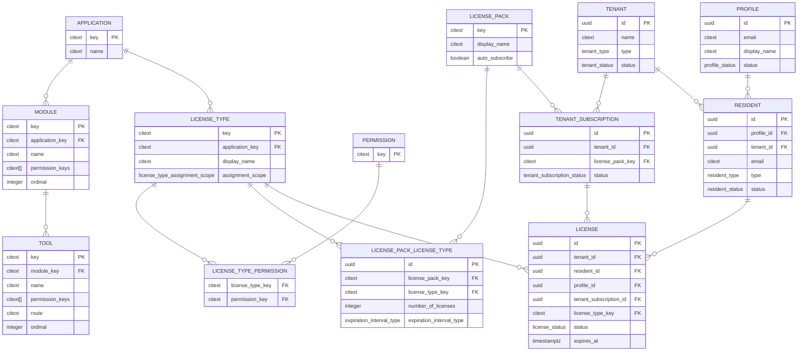
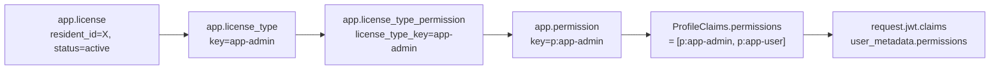
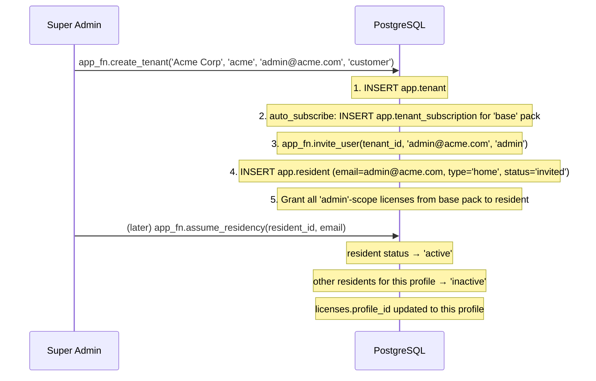

# Licensing & Permissions Model

## Overview

In fnb, a user has permissions because they hold **licenses**. There are no role assignments or direct permission grants. The chain is:

```
Tenant subscribes to a License Pack
    → which defines License Types
        → each License Type grants Permissions
            → a Resident gets a License (instance of a License Type)
                → their ProfileClaims.permissions is built from active licenses
                    → RLS policies check those permissions
```

---

## Entity Relationship Diagram



---

## Core Concepts

### Application
The top-level grouping. The platform has an `anchor` application (the base system) and feature applications (`my-app`, `msg-app`, etc.). Each application owns its license types.

**Built-in applications:**
- `anchor` — core platform (app-user, app-admin, app-admin-super, app-admin-support, app-address-book)
- `my-app` — example custom application

### Module & Tool
Navigation structure. Each module belongs to an application and has an ordered list of tools. Each module/tool has `permission_keys` — the user must have one of those permissions for the module/tool to appear in their navigation.

```
anchor application
├── base-tools module (p:app-user)
│   └── profile tool → /profile
├── base-admin module (p:app-admin)
│   ├── users tool → /admin/user
│   ├── licenses tool → /admin/license
│   └── subscriptions tool → /admin/subscription
└── base-site-admin module (p:app-admin-super)
    ├── tenants tool → /site-admin/tenant
    ├── users tool → /site-admin/user
    └── applications tool → /site-admin/application
```

### License Type
Defines a named category of access. Key fields:

| Field | Description |
|-------|-------------|
| `key` | Unique identifier (e.g. `app-admin`, `app-user`) |
| `application_key` | Which application this type belongs to |
| `assignment_scope` | Who can assign this license (see below) |

**Assignment Scopes:**

| Scope | Meaning |
|-------|---------|
| `user` | Can be granted to any user by an admin |
| `admin` | Granted to admins only (one per tenant, enforced by unique partial index) |
| `superadmin` | Only for super admins (anchor tenant only) |
| `support` | Only for support staff (anchor tenant only) |
| `none` | Cannot be individually assigned (granted as part of pack subscription) |
| `all` | Granted to everyone in the tenant automatically |

**Uniqueness enforcement** (partial indexes in `app.sql`):
```sql
-- Only one superadmin-scope license type per application
create unique index idx_uq_app_license_type_scope_superadmin
  on app.license_type(key, application_key)
  where assignment_scope = 'superadmin';
-- Same for admin, user, support scopes
```

### License Pack
A subscription bundle. A tenant subscribes to a license pack, which defines what license types (and how many) are available to that tenant.

**`number_of_licenses`**: `-1` = unlimited, `0` = tenant-level (one shared), `N` = hard cap.

**`auto_subscribe`**: if true, every new tenant automatically gets a subscription to this pack. The `base` license pack has `auto_subscribe = true`, so every new tenant gets `app-user` and `app-admin` license types.

### Tenant Subscription
The binding between a tenant and a license pack. One subscription per (tenant, license_pack). All licenses issued to residents in that tenant for those license types are linked to this subscription.

### License
The actual grant: **this resident holds this license type**. Unique per `(resident_id, license_type_key)`. Has a status (`active`, `inactive`, `expired`) and optional `expires_at`.

When a license is granted, `profile_id` is set from the resident's `profile_id` — this denormalization allows the RLS policy `view_own_profile_licenses` (`auth.profile_id() = profile_id`) to work efficiently.

---

## How Permissions Reach the JWT



The SQL join in `app_fn.current_profile_claims`:
```sql
_profile_claims.permissions = (
  SELECT array_agg(DISTINCT ltp.permission_key)
  FROM app.license_type_permission ltp
  JOIN app.license_type lt ON lt.key = ltp.license_type_key
  JOIN app.license l ON l.license_type_key = lt.key
  WHERE l.resident_id = _resident.id
  AND l.status = 'active'
);
```

This means: **revoking a license takes effect on next login** (or next call to `fetchUser()` which refreshes claims). No cache invalidation needed — the server middleware always re-fetches from DB anyway.

---

## Built-in License Types (anchor application)

| Key | Permissions | Scope |
|-----|-------------|-------|
| `app-user` | `p:app-user` | user |
| `app-admin` | `p:app-user`, `p:app-admin` | admin |
| `app-admin-super` | `p:app-user`, `p:app-admin`, `p:app-admin-super` | superadmin |
| `app-admin-support` | `p:app-user`, `p:app-admin`, `p:app-admin-support` | support |
| `app-address-book` | `p:address-book` | user |

### License Packs

**`anchor` pack** (NOT auto_subscribe):
- `app-admin-super` (superadmin scope) — unlimited
- `app-admin-support` (support scope) — unlimited
- Only the anchor tenant can ever subscribe to this pack (enforced by unique partial index)

**`base` pack** (auto_subscribe = true):
- `app-user` (user scope) — unlimited
- `app-admin` (admin scope) — unlimited
- Every new tenant automatically gets this subscription

---

## Tenant & Residency Model

### Tenant Types

| Type | Description |
|------|-------------|
| `anchor` | The platform operator's own tenant. Only one allowed. Holds super admin and support licenses. |
| `customer` | A real paying customer tenant. |
| `demo` | Demo/trial for sales. |
| `test` | Test tenants for automated testing. |
| `trial` | Self-service trial. |

### Resident Types

| Type | Description |
|------|-------------|
| `home` | The user's primary residency in this tenant (created when they first join or register). Only one home resident per profile (unique index). |
| `guest` | Additional tenancy — the user was invited to another tenant as a guest. |
| `support` | Created transiently when a support staff member uses `become_support()`. Not a real user. |

### Resident Statuses

| Status | Meaning |
|--------|---------|
| `invited` | Invited but not yet accepted. Profile may or may not exist. |
| `declined` | Invitation was declined. |
| `active` | Currently active in this tenant. |
| `inactive` | Not currently active (user switched to a different tenant, or deactivated). |
| `blocked_individual` | Blocked by this tenant's admin. |
| `blocked_tenant` | The tenant itself is blocked/suspended (platform-level). |
| `supporting` | A support-mode resident that is actively supporting this tenant. |

### Profile Status

| Status | Meaning |
|--------|---------|
| `active` | Normal user. |
| `inactive` | Deactivated (can't log in effectively). |
| `blocked` | Platform-blocked. Super admin action. |

---

## Lifecycle Example: New Tenant Onboarding



---

## `install_basic_application` — Module Registration Pattern

Custom feature modules register themselves by calling `app_fn.install_basic_application()`:

```sql
SELECT app_fn.install_basic_application(
  'my-app',              -- key
  'My Application',      -- name
  'A custom module',     -- description
  true,                  -- auto_subscribe (all new tenants get it)
  ARRAY[                 -- modules
    ROW(
      'my-module',
      'My Module',
      ARRAY['p:my-app']::citext[],
      'i-lucide-star',
      1,
      ARRAY[
        ROW('my-tool', 'My Tool', ARRAY['p:my-app']::citext[], 'i-lucide-star', '/my-app', 1)
      ]::app_fn.tool_info[]
    )
  ]::app_fn.module_info[]
);
```

This function:
1. Creates the `application` record
2. Creates `module` and `tool` records for navigation
3. Creates `my-app` (user) and `my-app-admin` (admin) license types
4. Creates the `permission` records (`p:my-app`, `p:my-app-admin`)
5. Creates the `license_type_permission` join records
6. Creates a license pack for the application
7. If `auto_subscribe=true`: every existing tenant gets subscribed; all new tenants will get subscribed automatically

---

## Nav Section Registration Pattern

Navigation sections are registered client-side in Nuxt plugins. The auth-layer plugin registers the base admin sections:

```typescript
// packages/auth-layer/app/plugins/nav-register.ts
export default defineNuxtPlugin(() => {
  const { register } = useNavRegistry()

  register([
    {
      title: 'Admin',
      permissionKey: 'p:app-admin',
      items: [
        { label: 'Users', route: '/admin/user', icon: 'i-lucide-users' },
        { label: 'Licenses', route: '/admin/license', icon: 'i-lucide-key' },
        { label: 'Subscription', route: '/admin/subscription', icon: 'i-lucide-receipt' },
      ]
    },
    {
      title: 'Site Admin',
      permissionKey: 'p:app-admin-super',
      items: [
        { label: 'Tenants', route: '/site-admin/tenant', icon: 'i-lucide-building' },
        { label: 'Users', route: '/site-admin/user', icon: 'i-lucide-users' },
        { label: 'Applications', route: '/site-admin/application', icon: 'i-lucide-layout-grid' },
      ]
    }
  ])
})
```

`useAppNav().availableSections` filters these at runtime: a section only appears if `user.permissions.includes(section.permissionKey)`.
