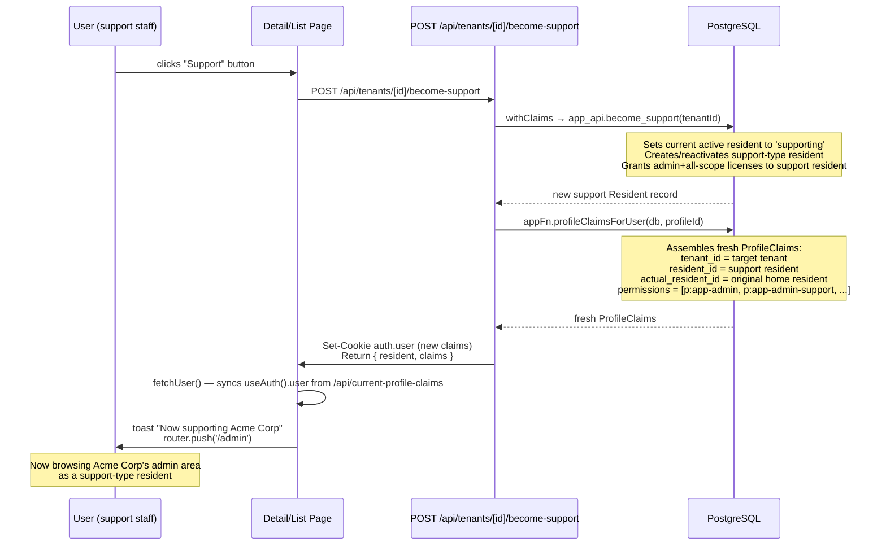

# Plan: Become Support — Tenant Admin UI

## Goal

Add a "Become Support" button to `/site-admin/tenant` (list) and `/site-admin/tenant/[id]` (detail). The button is only shown to users with `p:app-admin-support`. Clicking it calls `app_api.become_support`, refreshes the session claims, and redirects the user into the target tenant's admin area.

---

## What Already Exists (no work needed)

| Asset | Location | Status |
|-------|----------|--------|
| `app_api.become_support(tenant_id)` | `db/fnb-app/deploy/00000000010243_app_fn_support.sql` | ✅ deployed |
| `app_fn.become_support(tenant_id, profile_id)` | same file | ✅ deployed |
| `app_api.exit_support_mode()` | same file | ✅ deployed |
| `appApi.becomeSupport(db, tenantId)` | `packages/db-types/src/mutations/fnb-app/app_api/become-support.ts` | ✅ exported |
| `appApi.exitSupportMode(db)` | `packages/db-types/src/mutations/fnb-app/app_api/exit-support-mode.ts` | ✅ exported |
| Support button in `TenantList.vue` | `apps/tenant-app/app/components/TenantList.vue` | ✅ renders, emits `('support', tenant)` — wiring incomplete |

The only gap is: the `@support` event from `TenantList` is not handled in the parent page, there is no server API route, and there is no permission gate on the button.

---

## What Needs to Be Built

1. **Server API route** — `POST /api/tenants/[id]/become-support`
2. **Permission gate** — hide the button when user lacks `p:app-admin-support`
3. **List page** (`/site-admin/tenant/index.vue`) — handle the `@support` emit, show a confirmation, call the API
4. **Detail page** (`/site-admin/tenant/[id].vue`) — add the same button in the header actions row
5. **Post-action flow** — refresh claims cookie, redirect to tenant admin area
6. **Exit support mode** — surface an "Exit Support" button when the user is in support mode

---

## Step 1 — Server API Route

**New file: `apps/tenant-app/server/api/tenants/[id]/become-support.post.ts`**

```typescript
import { appApi } from '@function-bucket/fnb-db-types'
import { withClaims } from '@function-bucket/fnb-db-types'

export default defineEventHandler(async (event) => {
  const { db, claims } = event.context
  if (!claims) throw createError({ statusCode: 401 })

  const id = getRouterParam(event, 'id')!

  const resident = await withClaims(db, claims, (trx) =>
    appApi.becomeSupport(trx, id)
  )

  // The DB has now switched the active resident to a support-type resident
  // in the target tenant. Refresh claims from DB so the session cookie
  // reflects the new tenant/permissions on the next request.
  const { appFn } = await import('@function-bucket/fnb-db-types')
  const freshClaims = await appFn.profileClaimsForUser(db, claims.profileId!)

  const { cookieDomain } = useRuntimeConfig(event)
  const domain = cookieDomain || undefined
  const cookieOptions = {
    sameSite: 'lax' as const,
    maxAge: 60 * 60 * 24 * 7,
    secure: process.env.NODE_ENV === 'production',
    domain,
  }
  // Overwrite the auth.user cookie with the new claims so the client is in sync
  setCookie(event, 'auth.user', JSON.stringify(freshClaims), { ...cookieOptions, httpOnly: false })

  return { resident, claims: freshClaims }
})
```

**Why refresh the cookie here:** `withClaims` only affects the DB transaction. The `auth.user` cookie (the client-side claims cache) still reflects the old tenant. Rewriting it in the response means `useAuth().user` is immediately correct when the page loads after the redirect.

The `session` cookie does **not** need to change — it still holds the same `auth.user.id`. On the next request, the server middleware will automatically call `profileClaimsForUser` again and pick up the now-active support resident.

---

## Step 2 — Permission Gate on the Button

The button should only render when the current user has `p:app-admin-support`.

**`TenantList.vue`** — add a `canSupport` prop and conditionally render the button:

```typescript
// Current:
defineProps<{ tenants: Tenant[] }>()

// Change to:
defineProps<{
  tenants: Tenant[]
  canSupport?: boolean
}>()
```

```html
<!-- In the actions-cell template, wrap the button: -->
<template #actions-cell="{ row }">
  <UButton
    v-if="canSupport"
    size="sm"
    color="neutral"
    variant="ghost"
    icon="i-lucide-headset"
    @click="onSupport(row.original)"
  >
    Support
  </UButton>
</template>
```

The parent page passes the prop:
```html
<TenantList
  :tenants="tenants"
  :can-support="user?.permissions?.includes('p:app-admin-support')"
  @support="onSupport"
/>
```

---

## Step 3 — List Page (`/site-admin/tenant/index.vue`)

The page already renders `<TenantList>` but does nothing with `@support`. Add:

```typescript
const { user, fetchUser } = useAuth()
const router = useRouter()
const toast = useToast()

const pendingTenant = ref<Tenant | null>(null)
const supporting = ref(false)

function onSupport(tenant: Tenant) {
  pendingTenant.value = tenant
}

async function confirmSupport() {
  if (!pendingTenant.value) return
  supporting.value = true
  try {
    await $fetch(`/api/tenants/${pendingTenant.value.id}/become-support`, { method: 'POST' })
    await fetchUser()  // refresh useAuth().user from GET /api/current-profile-claims
    toast.add({ title: `Now supporting ${pendingTenant.value.name}`, color: 'success' })
    router.push('/admin')
  } catch {
    toast.add({ title: 'Failed to enter support mode', color: 'error' })
  } finally {
    supporting.value = false
    pendingTenant.value = null
  }
}
```

Add a confirmation modal to the template:

```html
<TenantList
  :tenants="tenants"
  :can-support="user?.permissions?.includes('p:app-admin-support')"
  @support="onSupport"
/>

<UModal v-model:open="!!pendingTenant">
  <template #header>Enter Support Mode</template>
  <p>
    You will become a support user in
    <strong>{{ pendingTenant?.name }}</strong>.
    Your current session will be suspended until you exit support mode.
  </p>
  <template #footer>
    <UButton color="warning" :loading="supporting" @click="confirmSupport">
      Confirm
    </UButton>
    <UButton variant="ghost" color="neutral" @click="pendingTenant = null">
      Cancel
    </UButton>
  </template>
</UModal>
```

---

## Step 4 — Detail Page (`/site-admin/tenant/[id].vue`)

Add the button alongside the existing Edit / Activate / Deactivate buttons in the card header:

```typescript
const { user, fetchUser } = useAuth()
const router = useRouter()
const supporting = ref(false)

const canSupport = computed(() =>
  user.value?.permissions?.includes('p:app-admin-support') ?? false
)

async function becomeSupport() {
  supporting.value = true
  try {
    await $fetch(`/api/tenants/${route.params.id}/become-support`, { method: 'POST' })
    await fetchUser()
    toast.add({ title: `Now supporting ${tenant.value?.name}`, color: 'success' })
    router.push('/admin')
  } catch {
    toast.add({ title: 'Failed to enter support mode', color: 'error' })
  } finally {
    supporting.value = false
  }
}
```

In the template, add alongside the existing action buttons in the `#header` slot:

```html
<UButton
  v-if="canSupport"
  size="sm"
  color="warning"
  variant="outline"
  icon="i-lucide-headset"
  :loading="supporting"
  @click="becomeSupport"
>
  Support
</UButton>
```

No confirmation modal is needed here because the user navigated to a specific tenant's detail page — the intent is already clear. (The list page needs confirmation because clicking Support in a table row is easier to do accidentally.)

---

## Step 5 — Post-Action Flow



---

## Step 6 — Exit Support Mode

When `residentId !== actualResidentId` in claims, the user is in support mode. Surface an exit button in the `UserProfileStatus` component or in the default layout header.

### Where to add it

**`packages/auth-layer/app/components/UserProfileStatus.vue`** — add below the existing avatar/name:

```html
<UButton
  v-if="isInSupportMode"
  size="xs"
  color="warning"
  variant="soft"
  icon="i-lucide-log-out"
  :loading="exiting"
  @click="exitSupport"
>
  Exit Support
</UButton>
```

```typescript
const { user, fetchUser } = useAuth()
const router = useRouter()
const exiting = ref(false)

const isInSupportMode = computed(() =>
  user.value?.residentId != null &&
  user.value?.actualResidentId != null &&
  user.value.residentId !== user.value.actualResidentId
)

async function exitSupport() {
  exiting.value = true
  try {
    await $fetch('/api/tenants/exit-support', { method: 'POST' })
    await fetchUser()
    router.push('/site-admin/tenant')
  } finally {
    exiting.value = false
  }
}
```

### New API route: `apps/tenant-app/server/api/tenants/exit-support.post.ts`

```typescript
import { appApi, appFn } from '@function-bucket/fnb-db-types'
import { withClaims } from '@function-bucket/fnb-db-types'

export default defineEventHandler(async (event) => {
  const { db, claims } = event.context
  if (!claims) throw createError({ statusCode: 401 })

  const resident = await withClaims(db, claims, (trx) =>
    appApi.exitSupportMode(trx)
  )

  const freshClaims = await appFn.profileClaimsForUser(db, claims.profileId!)

  const { cookieDomain } = useRuntimeConfig(event)
  const domain = cookieDomain || undefined
  setCookie(event, 'auth.user', JSON.stringify(freshClaims), {
    httpOnly: false,
    sameSite: 'lax',
    maxAge: 60 * 60 * 24 * 7,
    secure: process.env.NODE_ENV === 'production',
    domain,
  })

  return { resident, claims: freshClaims }
})
```

---

## File Checklist

### New files
- [ ] `apps/tenant-app/server/api/tenants/[id]/become-support.post.ts`
- [ ] `apps/tenant-app/server/api/tenants/exit-support.post.ts`

### Modified files
- [ ] `apps/tenant-app/app/components/TenantList.vue` — add `canSupport` prop, gate button visibility
- [ ] `apps/tenant-app/app/pages/site-admin/tenant/index.vue` — handle `@support` emit, add confirmation modal
- [ ] `apps/tenant-app/app/pages/site-admin/tenant/[id].vue` — add Support button in header actions
- [ ] `packages/auth-layer/app/components/UserProfileStatus.vue` — add Exit Support button when in support mode

### No DB changes needed
Everything at the database and db-types layer is already built and exported.

---

## Edge Cases to Handle

| Case | Behaviour |
|------|-----------|
| User clicks Support on the anchor tenant | `app_fn.become_support` will succeed but the anchor tenant has no meaningful admin content. Consider filtering anchor-type tenants out of the list or disabling the button for `type = 'anchor'`. |
| User is already in support mode for a different tenant | The DB handles this: `become_support` sets the current active resident to `supporting` and creates/reactivates the new support resident. The UI should still work; the cookie refresh covers the transition. |
| `becomeSupport` throws (e.g. tenant not found) | Caught in the `catch` block, toast error shown, no redirect, no cookie change. |
| User has `p:app-admin-super` but not `p:app-admin-support` | `app_api.become_support` allows both (`p:app-admin-super OR p:app-admin-support`). The frontend button visibility check should mirror this: `permissions.includes('p:app-admin-support') || permissions.includes('p:app-admin-super')`. |
