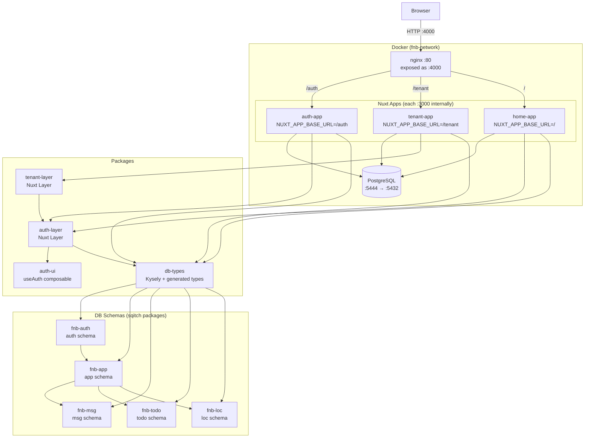

# fnb Architecture Documentation

> Deep-analysis reference for the fnb monorepo — generated May 2026.

## Executive Summary

**fnb** is a multi-tenant SaaS platform built as a Nuxt 4 monorepo. It implements a clean separation between authentication, identity, tenant management, licensing, and feature modules. The core philosophy is:

- **All authorization is enforced at the database layer** via PostgreSQL Row-Level Security (RLS), not in application code
- **Claims-based security**: a user's permissions travel as a signed JWT payload injected into the Postgres session via `set_config('request.jwt.claims', ...)`; every RLS policy reads from that
- **Residency model**: a `profile` (user) can belong to multiple `tenant`s via `resident` records; exactly one is active at a time
- **License-driven permissions**: permissions aren't stored on users — they flow from `license → license_type → permission` and are assembled fresh on each login
- **Module pattern**: every feature (msg, todo, loc) mirrors the core `app.tenant/resident` tables with parallel shadow tables, lazy-initialized on first use

---

## High-Level Architecture

---

## Document Index

| Doc | Description |
|-----|-------------|
| [01-architecture-overview.md](./01-architecture-overview.md) | Monorepo structure, tech stack, app descriptions, package dependency graph |
| [02-full-stack.md](./02-full-stack.md) | Every layer from PostgreSQL schema to Vue component; request lifecycle diagram |
| [03-tenant-user-example.md](./03-tenant-user-example.md) | End-to-end walkthrough of the tenant/user admin feature with sequence diagrams |
| [04-security.md](./04-security.md) | Login flow, JWT claims, `withClaims`, RLS policies, role model |
| [05-licensing-permissions.md](./05-licensing-permissions.md) | ER diagram for tenant/resident/license model; how permissions reach the UI |
| [06-special-cases.md](./06-special-cases.md) | Anchor tenant, support mode, multi-residency, trigger chains, invited users |
| [07-fnb-msg-steps.md](./07-fnb-msg-steps.md) | Step-by-step guide to add the complete fnb-msg (chat) stack |
| [08-implement-become-support.md](./08-implement-become-support.md) | Implementation plan: Become Support button on tenant list and detail pages |

---

## Quick Reference: Key Locations

| Thing | Path |
|-------|------|
| Login API | `apps/auth-app/server/api/auth/login.post.ts` |
| Server auth middleware | `apps/auth-app/server/_common/get-h3-event-claims.ts` |
| withClaims | `packages/db-types/src/with-claims.ts` |
| ProfileClaims type | `packages/db-types/src/generated/fnb-app/app_fn/ProfileClaims.ts` |
| useAuth composable | `packages/auth-ui/src/use-auth.ts` |
| Nav system | `packages/auth-layer/app/composables/useAppNav.ts` |
| Core DB schema | `db/fnb-app/deploy/00000000010220_app.sql` |
| RLS policies | `db/fnb-app/deploy/00000000010250_app_policies.sql` |
| Bootstrap function | `db/fnb-app/deploy/00000000010260_app_bootstrap.sql` |
| Claims assembly | `db/fnb-app/deploy/00000000010240_app_fn.sql` (line 500) |
| msg DB schema | `db/fnb-msg/deploy/00000000010400_msg.sql` |
| msg functions | `db/fnb-msg/deploy/00000000010410_msg_fn.sql` |
