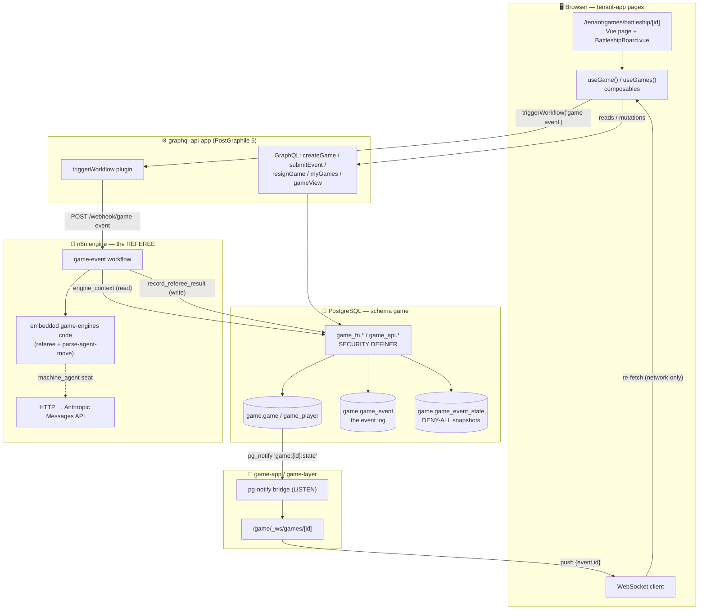
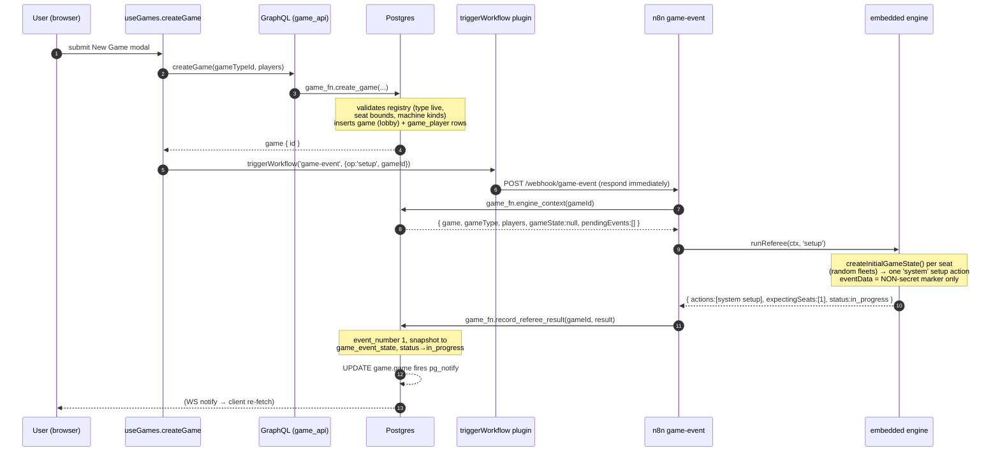

# The fnb Game Stack

*A human-readable guide to how the game platform fits together — from a click in the browser
to a ship sinking in the database and back.*

> This is a **narrative companion** to the authoritative specs under
> [`.claude/specs/game-server/`](../.claude/specs/game-server/). Where this doc and a spec
> disagree, the spec wins. Every code reference below links to the real file so you can inspect
> it directly.

---

## Table of contents

- [1. TL;DR](#1-tldr)
- [2. The big picture](#2-the-big-picture) — one diagram, the seven pieces
- [3. The one idea that explains everything: event sourcing](#3-the-one-idea-that-explains-everything-event-sourcing)
- [4. Component overview](#4-component-overview) — one paragraph per piece, linked to deep sections
- **End-to-end flows (with sequence diagrams)**
  - [5. Flow: creating a game (`setup`)](#5-flow-creating-a-game-setup)
  - [6. Flow: a human move](#6-flow-a-human-move)
  - [7. Flow: machine moves — the detailed walk-through](#7-flow-machine-moves--the-detailed-walk-through) ⬅ *the section you asked for*
  - [8. Flow: replay (the scrubber)](#8-flow-replay-the-scrubber)
  - [9. Flow: resign](#9-flow-resign)
- **Deep-detail sections**
  - [10. Deep dive: the database (`db/fnb-game`)](#10-deep-dive-the-database-dbfnb-game)
  - [11. Deep dive: the engine package (`packages/game-engines`)](#11-deep-dive-the-engine-package-packagesgame-engines)
  - [12. Deep dive: the n8n referee workflow (`game-event`)](#12-deep-dive-the-n8n-referee-workflow-game-event)
  - [13. Deep dive: the real-time layer (`game-layer` / `game-app`)](#13-deep-dive-the-real-time-layer-game-layer--game-app)
  - [14. Deep dive: the client layer (composables + pages)](#14-deep-dive-the-client-layer-composables--pages)
  - [15. Deep dive: the security model](#15-deep-dive-the-security-model)
- [16. Threat model — can someone cheat?](#16-threat-model--can-someone-cheat)
- [17. Adding a new game type](#17-adding-a-new-game-type)
- [18. Evaluation — shortcomings & risks](#18-evaluation--shortcomings--risks)

---

## 1. TL;DR

The game stack is an **event-sourced, multi-game platform**. Every change to a game — the
initial setup, each shot fired, each resignation — is an immutable **event row** in Postgres.
The rules of each game live in a **pure-TypeScript engine** ([`packages/game-engines`](../packages/game-engines)),
but that engine does **not** run in an app server. Instead its compiled code is **embedded into
an n8n workflow** ([`n8n/workflows/game-event.json`](../n8n/workflows/game-event.json)) that
acts as the single **referee**: the only actor trusted to validate a move and write the result.

Players never touch the engine. A browser submits a *desired* move through GraphQL, which parks
it as a `pending` event, then pings the referee. The referee reads the game, applies the rules,
writes the outcome (plus a per-event state snapshot), and a Postgres `NOTIFY` flows out over a
WebSocket to every open client, which simply **re-fetches** the current state.

**Machine opponents** (algorithm bots and Claude-powered agents) are handled entirely *inside*
that same referee run — see [§7](#7-flow-machine-moves--the-detailed-walk-through).

Two games are live today: **Battleship** and **Checkers**. Tic-Tac-Toe is a "Coming Soon"
placeholder.

---

## 2. The big picture



The seven pieces, and where they live:

| # | Piece | Lives in | Role |
|---|-------|----------|------|
| 1 | **Database** | [`db/fnb-game/`](../db/fnb-game) | The event log, snapshots, roster, and the `game_fn`/`game_api` function layers |
| 2 | **Engine package** | [`packages/game-engines/`](../packages/game-engines) | Pure-TS game rules + referee logic + machine-move selector; **tested here, embedded into n8n** |
| 3 | **n8n referee** | [`n8n/workflows/game-event.json`](../n8n/workflows/game-event.json) | The only actor that applies moves; runs the embedded engine + calls Anthropic for agents |
| 4 | **GraphQL API** | [`apps/graphql-api-app/`](../apps/graphql-api-app) | PostGraphile-exposed reads/mutations + the `triggerWorkflow` bridge to n8n |
| 5 | **Real-time layer** | [`packages/game-layer/`](../packages/game-layer) + [`apps/game-app/`](../apps/game-app) | WebSocket route + a Postgres `LISTEN/NOTIFY` bridge; a msg-layer mirror |
| 6 | **Client composables** | [`packages/graphql-client-api/`](../packages/graphql-client-api) | `useGame` / `useGames` / `useGameTypes` — all data access, all real-time logic |
| 7 | **UI pages** | [`apps/tenant-app/app/pages/games/`](../apps/tenant-app/app/pages/games) | The Vue pages + `BattleshipBoard.vue` (served by tenant-app, **not** game-app) |

---

## 3. The one idea that explains everything: event sourcing

If you understand this section, the rest of the stack falls into place.

**A game is not a mutable record — it is an append-only log of events.** There is no "current
board" column you can update. Instead:

- Every state change is a row in [`game.game_event`](../db/fnb-game/deploy/00000000011300_game.sql#L104):
  the `setup` that generates the fleets, every `move`, every `resign`.
- Applied events get a dense, gap-free `event_number` (1, 2, 3, …). The log **has no holes** —
  even a resignation is an event, so a game is fully **replayable forward and backward**.
- Alongside each applied event, the referee writes a **snapshot** to
  [`game.game_event_state`](../db/fnb-game/deploy/00000000011300_game.sql#L130): the full
  authoritative state *after* that event, plus one **redacted per-seat view** for each player.

Two consequences drive the whole design:

1. **The current state is just "the latest snapshot."** No engine runs to *read* a game — you
   `ORDER BY event_number DESC LIMIT 1`. Replay is "give me the snapshot at event N." This makes
   replay immune to engine-version drift (contrast with re-deriving state from a seed, which was
   [considered and rejected](../.claude/specs/game-server/README.md#L198)).

2. **Secrets live only in the snapshot table, which is deny-all.** Ship positions must never be
   visible to the opponent. The `game_event` log is tenant-readable once applied, so it carries
   *no* secret payload — the real state goes into `game_event_state`, which has RLS enabled with
   **zero policies**. See [§15](#15-deep-dive-the-security-model).

The "expectation" model deserves a note: instead of a scalar `current_turn`, a game carries
`expecting_seats int[]` — the seats it currently awaits an event from. For 1v1 games that's
always a single seat (strict alternation); the array exists so future simultaneous-phase games
(blackjack bets, trivia answers) can await several seats at once.

---

## 4. Component overview

One paragraph per piece. Each links to its deep-dive section.

**Database ([deep dive →](#10-deep-dive-the-database-dbfnb-game)).** The `game` schema holds the
agnostic `game.game` record (no game-specific columns — state is jsonb), the N-seat
`game.game_player` roster, the `game.game_event` log, the deny-all `game.game_event_state`
snapshots, and a `game.game_type` **registry table** (not an enum) whose rows carry per-type
rules. Two PL/pgSQL layers wrap it: `game_api.*` (the PostGraphile surface — checks permissions,
then delegates) and `game_fn.*` (SECURITY DEFINER internals). The referee's entire DB surface is
exactly **two** functions: `engine_context` (read) and `record_referee_result` (write).

**Engine package ([deep dive →](#11-deep-dive-the-engine-package-packagesgame-engines)).** Pure,
vitest-covered TypeScript with **no runtime app consumer**. It contains each game's rules
(`battleship/engine.ts`, `checkers/engine.ts`), a per-game *referee* wrapper that turns rules
into an ordered "actions list," and a machine-move selector. A dispatcher
([`src/referee.ts`](../packages/game-engines/src/referee.ts)) switches on `gameType.id`. An
**embed script** bundles this code and injects it into the n8n workflow's Code nodes.

**n8n referee ([deep dive →](#12-deep-dive-the-n8n-referee-workflow-game-event)).** A single
workflow, `game-event`, triggered once per submitted event. It reads the game via
`engine_context`, runs the embedded engine in a Code node, optionally calls Anthropic for an
agent seat, then writes everything back through `record_referee_result`. It is the **only**
actor trusted to apply a move — the client is never trusted with the engine.

**GraphQL API ([deep dive →](#14-deep-dive-the-client-layer-composables--pages)).** PostGraphile
5 auto-exposes `game`/`game_api`. Mutations (`createGame`, `submitEvent`, `resignGame`) and
reads (`myGames`, `gameView`, `gameById`) are `game_api` functions. A hand-written
[`triggerWorkflow` plugin](../apps/graphql-api-app/server/graphile/trigger-workflow.plugin.ts)
is the app→referee bridge: it POSTs to the n8n webhook.

**Real-time layer ([deep dive →](#13-deep-dive-the-real-time-layer-game-layer--game-app)).** A
mirror of the msg module. `game-app` serves one WebSocket route (`/game/_ws/games/[id]`); a
Nitro plugin holds a dedicated Postgres connection that `LISTEN`s on `game:{id}:state` channels
and forwards each notification to subscribed peers. The socket only ever carries a tiny
`{event, id}` ping — never game data.

**Client composables ([deep dive →](#14-deep-dive-the-client-layer-composables--pages)).** All
data access and real-time logic live in `packages/graphql-client-api/src/composables/`
(`useGame`, `useGames`, `useGameTypes`), re-exported thinly into tenant-app. `useGame` opens the
WebSocket, re-fetches on notify, drives the replay scrubber, and derives hit/miss/sunk toasts.

**UI pages.** The playable pages live in **tenant-app** (`/tenant/games/**`), not game-app —
game-app has no user pages, it only serves the socket. `BattleshipBoard.vue` renders the two
grids; the detail page adds the replay scrubber.

---

## 5. Flow: creating a game (`setup`)

Creating a game inserts the `game` + roster rows in `lobby` status, then fires the referee with
`op: 'setup'`, which generates the fleets and flips the game to `in_progress`.



Key files: [`useGames.createGame`](../packages/graphql-client-api/src/composables/useGames.ts#L29),
[`game_fn.create_game`](../db/fnb-game/deploy/00000000011310_game_fn.sql#L238),
[`refereeBattleship` (setup branch)](../packages/game-engines/src/battleship/referee.ts#L178).

Note the critical security detail baked into setup: the `setup` event's `event_data` is a
**non-secret marker** (`{ gameType, boardSize }`) — the generated fleet layout goes *only* into
the snapshot ([`referee.ts#L212`](../packages/game-engines/src/battleship/referee.ts#L212)). This
was a real leak caught during live verification; see [§15](#15-deep-dive-the-security-model).

---

## 6. Flow: a human move

A human move is a two-hop dance: the mutation *parks intent* as a pending event; the trigger
*asks the referee to adjudicate it*. The two are separate on purpose — the mutation never
applies anything.

```mermaid
sequenceDiagram
    autonumber
    participant U as User (browser)
    participant C as useGame.submitEvent
    participant G as GraphQL (game_api)
    participant DB as Postgres
    participant R as n8n game-event
    participant E as embedded engine
    participant B as pg-notify bridge / WS

    U->>C: click a cell on opponent board
    C->>G: submitEvent(gameId, {row,col})
    G->>DB: game_fn.submit_event(...)
    Note over DB: inserts a PENDING move event<br/>(one-pending-per-seat unique index is the hard guard)
    DB-->>C: ok
    C->>R: triggerWorkflow('game-event', {op:'event', gameId})
    R->>DB: engine_context(gameId) → includes pendingEvents
    R->>E: runReferee(ctx, 'event')
    Note over E: validate move (in-bounds, not already fired)<br/>→ 'apply' action with new snapshot,<br/>flip expectation to the other seat
    E-->>R: { actions:[apply], expectingSeats:[2] }
    R->>DB: record_referee_result(...)
    Note over DB: advisory lock + version check;<br/>event_number 2, snapshot written,<br/>UPDATE game.game → pg_notify
    DB->>B: NOTIFY game:{id}:state {event,id}
    B->>U: WS push
    U->>C: re-execute gameById query (network-only)
    C-->>U: board re-renders (hit/miss/sunk toast)
```

Key files: [`useGame.submitEvent`](../packages/graphql-client-api/src/composables/useGame.ts#L177),
[`game_fn.submit_event`](../db/fnb-game/deploy/00000000011310_game_fn.sql#L321),
[`refereeBattleship` (event branch)](../packages/game-engines/src/battleship/referee.ts#L224).

Why two hops and not one? Because **the referee is the only writer**. `submit_event` does
fail-fast UX pre-checks (is it your turn? is the game in progress?) but its real job is just to
record `pending` intent behind the one-pending-per-seat unique index. Everything authoritative —
"is this a legal shot? did it hit? whose turn now?" — happens in the referee.

---

## 7. Flow: machine moves — the detailed walk-through

*This is the section you specifically asked about.* Machine seats come in two kinds, and they
are handled very differently. The crucial thing to understand: **an algorithm move costs no
extra round-trip — it happens inside the very same referee run that processed the human move.**
An agent move needs one HTTP call to Anthropic, still inside the same run.

### 7.0 Where the two kinds diverge

Both kinds share the trigger path from [§6](#6-flow-a-human-move): a human moves → the referee
runs → the human's move is applied → now the game `expects` the machine seat. What happens next
depends on `player_kind`:

The heart of it is the **machine loop** inside the battleship referee wrapper,
[`runMachineLoop`](../packages/game-engines/src/battleship/referee.ts#L119):

```ts
// packages/game-engines/src/battleship/referee.ts
function runMachineLoop(w, actions, rand) {
  while (w.status === 'in_progress' && w.expecting.length === 1) {
    const seat = w.expecting[0]!
    const kind = kindOf(w.players, seat)
    if (kind === 'human') break                       // wait for a real person
    if (kind === 'machine_agent') {
      const view = w.views[String(seat)]!
      return {                                         // STOP — the HTTP branch finishes this
        needsAgentMove: true,
        agentContext: { seat, system: BATTLESHIP_AGENT_SYSTEM, view, legalMoves: legalMoves(view) },
      }
    }
    // machine_algorithm — selects from ITS OWN redacted view only (fairness lock)
    const cell = selectMachineMove(w.views[String(seat)]!, rand)
    applySeatMove(w, seat, cell)
    actions.push({ kind: 'machine', seat, eventType: 'move', eventData: cell,
                   stateAfter: dehydrateBlob(w), viewsAfter: w.views })
  }
  return { needsAgentMove: false }
}
```

Read that loop carefully — it is the whole story:

- **`machine_algorithm`**: the move is selected and applied **right here, in the Code node**, and
  appended to the same `actions` list as a `machine` action. The loop then continues (in an
  N-player game the *next* seat might also be a bot). No network hop, no second execution.
- **`machine_agent`**: the loop **stops without applying** and returns `needsAgentMove: true`
  plus an `agentContext`. It cannot apply yet — it needs Claude to pick the move first. The n8n
  workflow's `IF` node routes to the HTTP branch, which fills in the move.
- **`human`**: `break` — nothing to do, the game waits for a real submission.

### 7.1 The algorithm move (detailed)

An algorithm bot is a deterministic hunt/target selector,
[`selectMachineMove`](../packages/game-engines/src/battleship/select-move.ts). It operates **only
on the acting seat's redacted view** — it literally cannot see the human's ships, because the
view it's handed has them redacted (this is the *fairness lock*). Its logic: if any known `hit`
cell isn't yet part of a sunk ship, fire at a random unknown orthogonal neighbour (finish the
wounded ship — "target" mode); otherwise fire at a random unknown cell, preferring checkerboard
parity cells ("hunt" mode).

```mermaid
sequenceDiagram
    autonumber
    participant R as n8n: Code node "referee"
    participant E as runReferee → refereeBattleship
    participant L as runMachineLoop
    participant S as selectMachineMove
    participant W as record_referee_result

    Note over R,E: (still the SAME execution that applied the human's move)
    E->>L: after applying human move, expecting=[2] (bot)
    L->>L: kindOf(seat 2) == 'machine_algorithm'
    L->>S: selectMachineMove(views["2"], rand)
    Note over S: hunt/target on seat 2's REDACTED view only
    S-->>L: {row, col}
    L->>L: applySeatMove(w, 2, cell) → new snapshot
    L->>L: push 'machine' action; loop (expecting flips to [1] human → break)
    E-->>R: actions = [apply(human), machine(bot)]
    R->>W: record_referee_result(gameId, result)
    Note over W: writes BOTH events (numbers N+1, N+2),<br/>two snapshots, one pg_notify
```

So a single human move against an algorithm bot produces **two applied events in one referee
run** — verified live (`appliedEvents: 2, machineEvents: 1`). The IF node's condition
(`needsAgentMove`) is false, so the HTTP branch is skipped entirely.

### 7.2 The agent move (detailed)

An agent seat is powered by a live call to the **Anthropic Messages API** (model
`claude-haiku-4-5-20251001`), using the same `ANTHROPIC_API_KEY` as the agentic engine. The
referee can't apply the move itself — it needs Claude's answer first — so it emits
`needsAgentMove` and the workflow takes over:

```mermaid
sequenceDiagram
    autonumber
    participant REF as Code: referee
    participant IF as IF node: needsAgentMove?
    participant HTTP as HTTP: anthropic-move
    participant CL as Anthropic Messages API
    participant PARSE as Code: parse-agent-move
    participant W as record_referee_result

    REF->>IF: result { needsAgentMove:true, agentContext:{seat, system, view, legalMoves} }
    IF->>HTTP: true branch
    Note over HTTP: POST /v1/messages<br/>system = agentContext.system (engine-supplied!)<br/>user = JSON.stringify(agentContext)  ← ONLY the redacted view
    HTTP->>CL: request (retry ≤2, x-api-key credential)
    CL-->>HTTP: { content:[{text:'{"row":3,"col":7}'}] }
    HTTP->>PARSE: completeAgentMove(ctx, prior.result, text)
    Note over PARSE: parse {row,col}; validate vs the seat's view;<br/>ILLEGAL/unparseable → fall back to selectMachineMove
    PARSE->>W: result with the machine action appended
    Note over W: same write path; agentFallback flag recorded
```

Two things make this robust and fair:

1. **Fairness.** The prompt receives *only* `agentContext` — the acting seat's **redacted view**
   plus the legal-move list. It never sees `game_state` or the opponent's fleet. The system
   prompt itself is **engine-supplied** ([`BATTLESHIP_AGENT_SYSTEM`](../packages/game-engines/src/battleship/referee.ts#L31)),
   so the workflow's HTTP node carries no game-specific text and never changes when a new game
   type is added.
2. **Never wedges.** If Claude returns prose, malformed JSON, or an illegal cell,
   [`completeBattleshipAgentMove`](../packages/game-engines/src/battleship/referee.ts#L285)
   **falls back to the algorithm selector** and records `agentFallback: true`. A bad completion
   can never leave a game stuck.

```ts
// packages/game-engines/src/battleship/referee.ts — the fallback, verbatim
let agentFallback = false
if (!cell) {
  cell = selectMachineMove(view, rand)   // Claude gave us nothing usable → hunt/target
  agentFallback = true
}
applySeatMove(w, seat, cell)
```

### 7.3 Why "one execution per trigger" and not a long-lived loop

n8n runs **one execution per submitted event**. Machine replies happen *inside* that execution
(the loop above). The alternative — one long-lived execution per game parked on a Wait node —
was [rejected](../.claude/specs/game-server/README.md#L206): it would require storing signed
per-execution resume URLs in the DB and POSTing them on every move. Per-move executions are
simpler and match the "respond immediately" webhook invariant. The one limitation: the current
graph makes **at most one agent HTTP call per execution**, which is sufficient for every 2-seat
game. Consecutive agent seats in a future N-player game would need an n8n loop around the HTTP
branch (a [documented open item](../.claude/specs/game-server/README.md#L164)).

---

## 8. Flow: replay (the scrubber)

Because every applied event has a snapshot, replay is trivial: ask for the caller's redacted
view *at a given event number*. No engine runs.

- The client composable [`useGame`](../packages/graphql-client-api/src/composables/useGame.ts#L75)
  holds `replayEvent: number | null` (`null` = live). `stepBack`/`stepForward` change it and
  re-run the `gameViewAt` query network-only.
- That query calls [`game_api.game_view(gameId, eventNumber)`](../db/fnb-game/deploy/00000000011320_game_api.sql#L82)
  → [`game_fn.player_view`](../db/fnb-game/deploy/00000000011310_game_fn.sql#L412), which returns
  **only the caller's seat's** view from the snapshot at that event (or the latest, when
  `eventNumber` is NULL).

Stepping forward past the last event returns to "live." One function serves both live play and
the scrubber.

---

## 9. Flow: resign

A resignation is **an event through the referee**, not a direct status update — otherwise the
log would have a hole and replay would break.

[`game_fn.resign_game`](../db/fnb-game/deploy/00000000011310_game_fn.sql#L368) rejects any
pending move by the resigner (`superseded_by_resign`) and inserts a pending `resign` event. The
composable then fires the referee (`op: 'event'`), which applies it generically: mark the seat
`resigned_at`, recompute `expecting_seats` without it, and when only one active seat remains →
`complete` with per-seat `outcome`s. For a 2-seat game, any resign ends the game.

---

## 10. Deep dive: the database (`db/fnb-game`)

Four sqitch changes, deployed **last** in the package order (it needs `fnb-res`'s registry,
`fnb-app`'s policies, and `fnb-n8n`'s `n8n_worker` role):

| Change | File | Contents |
|--------|------|----------|
| `game` | [`00000000011300_game.sql`](../db/fnb-game/deploy/00000000011300_game.sql) | schemas, enums, the `game_type` registry (+3 seed rows), `game`, `game_player`, `game_event`, `game_event_state`, the notify trigger |
| `game_fn` | [`00000000011310_game_fn.sql`](../db/fnb-game/deploy/00000000011310_game_fn.sql) | SECURITY DEFINER internals: `engine_context`, `record_referee_result`, `create_game`, `submit_event`, `resign_game`, `player_view` |
| `game_api` | [`00000000011320_game_api.sql`](../db/fnb-game/deploy/00000000011320_game_api.sql) | SECURITY INVOKER PostGraphile surface: permission gate → delegate to `game_fn` |
| `game_policies` | [`00000000011330_game_policies.sql`](../db/fnb-game/deploy/00000000011330_game_policies.sql) | grants, RLS policies, and the two `n8n_worker` grants |

### The tables

- **`game.game_type`** — a seeded **registry table, not an enum**. Each row carries per-type
  rules as *data*: `status` (`live`/`coming_soon`/`retired`), `min/max_player_seats`,
  `supported_player_kinds`, and a `default_config` jsonb (e.g. `{"boardSize": 10}`). This is why
  `create_game` can enforce "battleship = exactly 2 seats" without any hardcoded logic, and why
  adding a game type needs **zero DDL**.
- **`game.game`** — deliberately **agnostic**: no game-specific columns, no per-seat columns.
  Just `game_type_id` (FK to the registry), `status`, `seat_count`, `expecting_seats int[]`,
  `event_count`, and a generated `urn` (it's a registered business resource).
- **`game.game_player`** — the N-seat roster. Each seat is a `human` (with `resident_urn`) or a
  machine (`machine_algorithm` / `machine_agent`, `resident_urn` NULL). Carries per-seat
  `outcome` and `resigned_at`.
- **`game.game_event`** — the log. Note the two indexes that enforce the core invariants: a
  unique `(game_id, event_number)` for the dense sequence, and a **partial unique index**
  `(game_id, seat) WHERE status = 'pending'` — the *hard* one-pending-event-per-seat guard.
- **`game.game_event_state`** — deny-all snapshots (see [§15](#15-deep-dive-the-security-model)).

### The two functions the referee uses

The referee's *entire* database surface is two functions — nothing else is granted to
`n8n_worker`:

- [`game_fn.engine_context(game_id)`](../db/fnb-game/deploy/00000000011310_game_fn.sql#L13) — one
  read that assembles everything the engine needs: game summary, the registry row, the seat
  roster, the latest snapshot (state + views), and **all** pending events oldest-first.
- [`game_fn.record_referee_result(game_id, result)`](../db/fnb-game/deploy/00000000011310_game_fn.sql#L88)
  — one atomic write that applies the whole ordered `actions` list. This function is where the
  concurrency safety lives — see below.

### Concurrency: the advisory lock + version guard

`record_referee_result` must survive duplicate/racing executions (the trigger is fire-and-forget
and any app user may fire it). It does this in two layers:

```sql
-- db/fnb-game/deploy/00000000011310_game_fn.sql
PERFORM pg_advisory_xact_lock(hashtextextended(_game_id::text, 0));   -- serialize per game
SELECT * INTO _game FROM game.game WHERE id = _game_id FOR UPDATE;

-- stale-context guard: discard the WHOLE result if the game moved on since this
-- execution's engine_context read
IF _result ? 'expectedEventCount'
   AND (_result->>'expectedEventCount')::int IS DISTINCT FROM _game.event_count THEN
  RETURN jsonb_build_object('recorded', false, 'noop', true, 'reason', 'stale_context', ...);
END IF;
```

The advisory lock alone is **not enough**, and this was a real bug caught in live testing: two
racing executions each read the same pre-move state, each *independently computed its own machine
reply*, and — because the advisory lock only serializes the *write* — each inserted a distinct
machine move, corrupting the log with two bot replies to one human move. The fix is the
**`expectedEventCount` optimistic-concurrency check**: the referee stamps the result with the
`event_count` it assumed, and the DB discards the entire result as a `stale_context` noop if
another execution has written since. Verified live under a 3-way concurrent trigger: exactly one
apply + one machine reply, two clean noops.

---

## 11. Deep dive: the engine package (`packages/game-engines`)

Pure TypeScript, vitest-covered, **no runtime app consumer**. The runtime consumer is the n8n
Code node, reached via the embed script.

```
packages/game-engines/src/
├── referee.ts              # dispatcher: runReferee / completeAgentMove — switch on gameType.id
├── referee-types.ts        # the I/O contract mirroring engine_context / record_referee_result
├── n8n-embed.ts            # the embed entry — assigns to globalThis.GameEngines
├── battleship/
│   ├── engine.ts           # pure single-board rules: createInitialGameState + applyMove
│   ├── serialize.ts        # PlacedShip.hits Set<string> ⇄ string[] for jsonb
│   ├── views.ts            # per-seat redacted view computation
│   ├── referee.ts          # two-board wrapper → the actions list (+ the machine loop)
│   └── select-move.ts      # hunt/target machine-move selector
├── checkers/               # same shape for English draughts
└── tests/                  # vitest — including an embed-drift check
```

### The layered design

- [`engine.ts`](../packages/game-engines/src/battleship/engine.ts) is a **single-board** engine —
  it knows nothing about opponents or turns. `createInitialGameState` places a fleet randomly;
  `applyMove` fires one shot and returns a new state (`hit`/`miss`/`sunk`), throwing `RangeError`
  or `ALREADY_FIRED` for illegal shots. A board reaching status `'won'` means **its owner lost**
  (all their ships are sunk).
- [`referee.ts`](../packages/game-engines/src/battleship/referee.ts) is the **two-board wrapper**.
  It holds one engine board per seat (`seats["1"]` is seat 1's own fleet), so a shot *by* seat 1
  is an `applyMove` on seat 2's board. It handles turn order, win detection, the machine loop,
  and — crucially — emits the ordered **actions list** where every applying action carries its
  own `stateAfter`/`viewsAfter` snapshot.
- The **dispatcher** [`src/referee.ts`](../packages/game-engines/src/referee.ts) is the single
  entry point the n8n glue calls; it switches on `gameType.id`.

### The actions-list contract

The engine's output is a flat, ordered list the DB replays verbatim. Each entry is one of
([`referee-types.ts#L50`](../packages/game-engines/src/referee-types.ts#L50)):

| `kind` | Meaning | Writes an event? |
|--------|---------|------------------|
| `system` | The `setup` event (initial fleets) | ✅ + snapshot |
| `apply`  | A submitted pending event was accepted | ✅ + snapshot |
| `reject` | A submitted pending event was refused (with reason) | marks it `rejected`, no number |
| `machine`| A bot/agent move the referee generated | ✅ + snapshot |

### The embed script — how tested code reaches n8n

n8n Code nodes can't `import` repo packages, so
[`scripts/embed.mjs`](../packages/game-engines/scripts/embed.mjs) esbuild-bundles
[`src/n8n-embed.ts`](../packages/game-engines/src/n8n-embed.ts) into a self-contained IIFE that
assigns to `globalThis.GameEngines`, then JSON-patches the `jsCode` of the `referee` and
`parse-agent-move` nodes inside `game-event.json`. A vitest **drift check**
([`tests/embed-drift.spec.ts`](../packages/game-engines/src/tests/embed-drift.spec.ts)) compares
the bundle hash to what's embedded, so stale inline JS fails CI. **Never hand-edit the workflow's
`jsCode`** — always re-run `pnpm --filter @function-bucket/fnb-game-engines embed`.

---

## 12. Deep dive: the n8n referee workflow (`game-event`)

Definition: [`n8n/workflows/game-event.json`](../n8n/workflows/game-event.json) (imported
**active** at boot). Spec: [`game-event.workflow.data.md`](../.claude/specs/game-server/game-event.workflow.data.md).

### Node graph

```
Webhook (respond immediately)
  → PG: begin_run            n8n_fn.begin_run('game-event', execution.id, payload, tenantId)
  → PG: engine_context       game_fn.engine_context(gameId)
  → Code: referee            (embedded — runReferee(ctx, op))
  → IF needsAgentMove?
      ├─ true  → HTTP: anthropic-move → Code: parse-agent-move (embedded completeAgentMove) ─┐
      └─ false ───────────────────────────────────────────────────────────────────────────┤
  → PG: record_referee_result  game_fn.record_referee_result(gameId, result)
  → PG: complete_run           n8n_fn.complete_run(runId, summary)
```

- All PG nodes use the `fnb-n8n-worker` credential — the referee acts as `n8n_worker`, whose
  entire DB surface is the two granted functions. Fixed SQL text with parameters only.
- The workflow's error settings point at the shared **`error-handler`** workflow, which records
  a terminal `n8n.workflow_run` error row. Pending events stay `pending` and can be retried.
- Every run is bracketed by `begin_run`/`complete_run` against the `n8n.workflow_run` log (the
  parallel n8n engine's run ledger — see [`n8n-parallel-engine`](../.claude/specs/n8n-parallel-engine/)).

### Failure & recovery matrix

| Failure | Outcome |
|---------|---------|
| Any node throws (bad game_type id, engine invariant, PG error, Anthropic 4xx with no fallback reached) | error-handler → terminal `error` run; pending events stay `pending` |
| Stranded pending event (execution died) | Re-trigger `op:'event'`; processed oldest-first, idempotently. Re-submission blocked by the one-pending-per-seat index |
| Concurrent duplicate executions | `expectedEventCount` guard discards the loser's whole result as `stale_context` |
| Duplicate/rogue trigger | Referee returns empty `actions`; run completes as a noop |
| Game stuck in `lobby` (lost setup trigger) | Detail page re-fires `setup` after 5s (no-ops unless still `lobby`) |
| Agent responds illegally | Algorithm fallback (`agentFallback: true`) — never an error |

---

## 13. Deep dive: the real-time layer (`game-layer` / `game-app`)

A near-exact mirror of the msg module's socket layer.

- **`apps/game-app`** — extends `game-layer`, serves nginx path `/game`, has **no user pages**.
  Its only job is the WebSocket route.
- **[`packages/game-layer/server/routes/_ws/games/[id].ts`](../packages/game-layer/server/routes/_ws/games/[id].ts)** —
  the one route. On `upgrade` it validates the sealed `session` cookie → claims (401 if absent);
  there is **no per-game seat check** — the socket only ever carries `{event, id}` pings, so
  there's nothing to leak. On `open` it subscribes to the `game:{id}:state` channel.
- **[`packages/game-layer/server/plugins/pg-notify-bridge.ts`](../packages/game-layer/server/plugins/pg-notify-bridge.ts)** —
  a Nitro plugin holding **one dedicated `pg.Client`** (not a pool — `LISTEN` state is
  per-connection) with a ref-counted channel→peers map. When Postgres notifies
  `game:{id}:state`, it forwards the raw payload to every subscribed peer. It also patches h3's
  websocket `resolve` (the auth middleware otherwise intercepts WS upgrades before the router — a
  load-bearing fix, don't remove it).

The notify itself is fired by a table trigger
([`game.game` AFTER UPDATE → `pg_notify`](../db/fnb-game/deploy/00000000011300_game.sql#L148)).
Since **every** referee write updates `game.game` (at minimum `event_count`/`updated_at`), every
applied change produces exactly one notify. The payload is deliberately minimal — the client uses
it only as a "something changed, re-fetch" signal.

---

## 14. Deep dive: the client layer (composables + pages)

Per the stack's core rule (R1), **all data access goes through composables**; pages never touch
the transport. The real implementations live in `graphql-client-api` and are re-exported thinly
into tenant-app.

| Composable | File | Role |
|-----------|------|------|
| `useGames` | [`useGames.ts`](../packages/graphql-client-api/src/composables/useGames.ts) | List page: `myGames` query + `createGame` (mutation → setup trigger → refresh). **Not** real-time |
| `useGame` | [`useGame.ts`](../packages/graphql-client-api/src/composables/useGame.ts) | Detail page: live query + WS refetch + replay scrubber + move-result toasts |
| `useGameTypes` | [`useGameTypes.ts`](../packages/graphql-client-api/src/composables/useGameTypes.ts) | The `game_type` registry (powers the New Game modal) |

`useGame` is the interesting one. It:

1. Runs the `gameById` query for the live state and the caller's redacted `gameView`.
2. Opens the WebSocket to `/game/_ws/games/{id}` and, on any message,
   **re-executes the query network-only** — a whole-state refetch rather than msg's incremental
   read (a deliberate deviation; the query already exists, so no REST carve-out is needed).
3. Drives the replay scrubber (`replayEvent`, `stepBack`/`stepForward`/`goLive`).
4. Derives hit/miss/sunk (or checkers capture) **toasts** by diffing consecutive live views —
   keeping derivation and transport out of the components.
5. `submitEvent` / `resign` both follow the mutation→trigger pattern.

The pages ([`apps/tenant-app/app/pages/games/`](../apps/tenant-app/app/pages/games)) are served
by **tenant-app**, cross-connecting to game-app's socket exactly as they do to `/msg/_ws/…`.
Note: `/games/**` requires `routeRules: { ssr: false }` in tenant-app's nuxt config — the urql
plugin is client-only, and missing this 500s every game page.

---

## 15. Deep dive: the security model

Four overlapping mechanisms keep games fair and tenant-isolated.

**1. Two-layer function pattern (`_api` gates, `_fn` acts).** The PostGraphile-exposed
`game_api.*` functions ([file](../db/fnb-game/deploy/00000000011320_game_api.sql)) each start with
`jwt.enforce_any_permission('{p:app-user,p:app-admin}')`, then delegate to a `game_fn` internal,
passing the caller's rebuilt resident URN. `game_fn` is a **closed surface** — deliberately *not*
the broad grant-all-routines pattern, so callers can't bypass the `_api` gates.

**2. Writes only through the referee.** `game.game` and its children have **no INSERT/UPDATE RLS
policies**. The only writes happen via SECURITY DEFINER `game_fn` functions. Players submit
`pending` intent; only `record_referee_result` (as `n8n_worker`) applies anything.

**3. The deny-all snapshot table.** Ship positions must be invisible to the opponent — live *and*
at every replay step. Column-level revokes don't work in Postgres (table-level SELECT wins), so
the secret state lives in a separate table with **RLS enabled and zero policies**, plus an
explicit `REVOKE`:

```sql
-- db/fnb-game/deploy/00000000011330_game_policies.sql
revoke all on game.game_event_state from anon, authenticated, service_role;
alter table game.game_event_state enable row level security;   -- zero policies = deny all
```

Only `game_fn.player_view` (SECURITY DEFINER) reads it, and it returns **only the caller's seat's
redacted view** — never `game_state_after`, never another seat's view. This same table is
smart-tagged out of the GraphQL schema entirely. *This is the mechanism that was almost defeated*
— the `setup` event originally leaked both fleets through the tenant-readable `event_data`
column; the fix confines all secret state to this table (see the comment at
[`referee.ts#L212`](../packages/game-engines/src/battleship/referee.ts#L212)).

**4. Pending-event visibility.** A `pending` event (and its payload) is visible **only to its
submitting seat** via an RLS `EXISTS` sub-check
([policy](../db/fnb-game/deploy/00000000011330_game_policies.sql#L56)); applied events are
tenant-readable. Battleship never needs this (its moves aren't secret), but simultaneous-phase
games (blackjack bets) must not leak held submissions.

**5. Machine fairness.** Every machine seat — algorithm *and* agent — selects from **its own
seat's redacted view only**, never from `game_state`. The agent prompt is handed nothing but
`agentContext`.

**The `n8n_worker` surface** is exactly two `EXECUTE` grants and no table access at all
([policies file, bottom](../db/fnb-game/deploy/00000000011330_game_policies.sql#L74)) — the
referee can adjudicate games and read/write *nothing* else.

---

## 16. Threat model — can someone cheat?

Short answer: **not in the ways that decide a game** — a player can't see the opponent's fleet
and can't forge or sneak in an illegal move. The exposed surface is **cost and griefing**, not
competitive integrity. This section is the adversarial read of [§15](#15-deep-dive-the-security-model);
the actor is an authenticated tenant user (`p:app-user`) doing whatever they like through
GraphQL, the browser devtools, or by hand-crafting requests.

### What a malicious client actually controls

Everything a player can do goes through the `game_api` surface: `createGame`, `submitEvent`,
`resignGame`, `myGames`, `gameView`, `gameById`, raw RLS-scoped reads on `game.*`, and
`triggerWorkflow('game-event', {op, gameId})`. They **cannot** reach the engine (it runs in
n8n), the referee write path, or the snapshot table. Every defense below follows from that split.

### Defended — the cheats that don't work

| Attempt | Why it fails |
|---------|--------------|
| **See the opponent's ships** (devtools, edit Vue state, craft GraphQL) | The client is *never sent* the fleet. Redaction happens server-side in the engine; the only view you receive is [`game_fn.player_view`](../db/fnb-game/deploy/00000000011310_game_fn.sql#L412) → **your seat only**. Secret state lives in the deny-all [`game.game_event_state`](../db/fnb-game/deploy/00000000011330_game_policies.sql#L18) (RLS on, zero policies, explicit `REVOKE`). No RLS-readable row holds a fleet — `setup`'s `event_data` is a non-secret marker, moves carry only `{row,col}` |
| **Read another seat's view via the API** | `game_api.game_view` rebuilds *your* URN from the JWT; `player_view` looks up the seat by that URN. Ask for a game you're not in → `30000 NOT AUTHORIZED` |
| **Call `game_fn.*` directly** (e.g. `player_view` with a chosen URN) | `game_fn` is not in `pgServices.schemas` — PostGraphile exposes only `game`/`game_api`, so there's no GraphQL field for it |
| **Make an illegal / out-of-turn move** | `submit_event`'s checks are fail-fast UX; the referee re-validates and emits a `reject` (not-expected, out-of-bounds, already-fired). The engine's `applyMove` throws on illegal shots → mapped to a rejection |
| **Queue extra shots** | The one-pending-per-seat [partial unique index](../db/fnb-game/deploy/00000000011300_game.sql#L120) hard-blocks a second pending event; the referee flips the expectation to the opponent after applying |
| **Forge a favorable result** | [`record_referee_result`](../db/fnb-game/deploy/00000000011310_game_fn.sql#L88) is granted only to `n8n_worker` and isn't exposed. The trigger you *can* send is just `{op, gameId}`; the referee ignores it and re-reads the game via `engine_context` |
| **Re-roll a losing board** (`op:'setup'` on a live game) | The setup branch no-ops unless `status = 'lobby'` ([referee](../packages/game-engines/src/battleship/referee.ts#L180)), and `record_referee_result` re-guards the `system` action the same way |
| **Trigger someone else's game / spam duplicates** | Harmless — the referee no-ops without pending work, and the advisory-lock + `expectedEventCount` guard discards stale/duplicate writes |
| **Cross-tenant play or snooping** | RLS scopes every read by `tenant_id`; `create_game` requires human seats to be residents of the same tenant |

The load-bearing idea: **redaction is in the engine and secrets never leave the deny-all table**,
so there is no client-side state to tamper with — the browser only ever holds your own redacted
view.

### Abusable — real vectors, mostly cost & griefing

- **Burn the tenant's Anthropic budget.** Every human move in a vs-agent game is a live Claude
  call with **no rate or spend cap** ([gap](../.claude/specs/game-server/README.md#L171)). Worse,
  in the window between your move and the agent's reply landing, concurrent `op:'event'` triggers
  each read "agent move pending" and each fire the HTTP call **before** the version guard rejects
  the losing writes — so deliberate spam-triggering amplifies cost beyond one-call-per-move. It's
  your own game, but a malicious tenant member can grief the shared bill.
- **Create unlimited games** — no throttle on `createGame`.
- **Stall forever** — no turn clock; an opponent who never moves leaves the game `in_progress`
  indefinitely (resign is the only exit).

### Latent — safe today, fragile tomorrow

- **`game_fn.player_view` is granted to `authenticated`** ([grant](../db/fnb-game/deploy/00000000011330_game_policies.sql#L28)).
  Safe *only* because the sole reachable caller rebuilds your URN from the JWT. Exposing `game_fn`
  in `pgServices.schemas`, or adding any function that forwards a caller-supplied URN, turns this
  into a direct fleet read. Worth a guarding comment.
- **The WS upgrade has no per-game seat check** ([route](../packages/game-layer/server/routes/_ws/games/[id].ts#L22)) —
  any authenticated user can subscribe to any `game:{id}:state` channel. The payload is only
  `{event, id}`, so this leaks **update timing**, never data. Harmless for battleship; a
  theoretical side channel for a future cadence-sensitive game type.
- **The entire write path's integrity rests on two guards** (the advisory lock + `expectedEventCount`
  check in [`record_referee_result`](../db/fnb-game/deploy/00000000011310_game_fn.sql#L107)).
  Correct and tested, but load-bearing single points — the double-apply bug they replaced was
  subtle enough that a careless refactor could reintroduce a variant.

### Bottom line

The competitive-integrity threats — seeing ships, cheating a move, forging a win — are designed
out properly, and the architecture (redaction-in-engine + deny-all snapshots + referee-only
writes) holds. The unguarded surface is **cost and griefing**, which the spec already tracks as
deferred product scope rather than defended (see [§18](#18-evaluation--shortcomings--risks)).

---

## 17. Adding a new game type

Because the DB is agnostic and rules are data, adding a game type is a well-worn path with
**zero DDL** (this is exactly how Checkers was added — see
[`checkers/`](../.claude/specs/game-server/checkers)):

1. **Registry**: flip/insert a `game.game_type` seed row (`status = 'live'`, seat bounds,
   supported kinds, `default_config`).
2. **Engine module**: add `packages/game-engines/src/<game>/` (engine, serialize, views, referee,
   select-move) mirroring battleship, and add a `case` to the dispatcher
   [`src/referee.ts`](../packages/game-engines/src/referee.ts). Put the agent system prompt on
   `agentContext.system` so the workflow stays game-agnostic.
3. **Re-embed**: run the embed script so the new engine code lands in `game-event.json`.
4. **UI**: add a page under `apps/tenant-app/app/pages/games/<game>/` + a board component, a
   fnb-types view type, `.graphql` documents, and a nav tool row.

No new tables, no workflow surgery, no changes to `record_referee_result`.

---

## 18. Evaluation — shortcomings & risks

The stack is coherent and its core invariants (event-log integrity, referee-only writes, secret
isolation, fairness) are well-defended and live-verified. The gaps below are real but mostly
**deferred product scope**, not architectural mistakes. Ranked roughly by how much they'd bite.

### Correctness / robustness

- **No interactive browser E2E pass.** Everything reachable without a browser was verified live
  (HTTP route checks, DB/RLS/grant state, the full referee behaviour matrix under real
  concurrency). But no human-driven click-through (two-client live WS update, the New Game modal,
  the scrubber UI, nav gating) was completed — the session's browser tool couldn't reach the
  Docker network. This is the single most important open item
  ([README Known Gaps](../.claude/specs/game-server/README.md#L156)).
- **The trigger is unauthenticated fire-and-forget from the client's perspective.** Any app user
  can POST `triggerWorkflow('game-event', …)` for any game id in their tenant. This is *safe* by
  construction (the referee no-ops without pending work; the advisory-lock + version guard makes
  duplicates harmless), but it does mean the referee's safety rests entirely on those two guards
  being correct. They're well-tested, but they are load-bearing single points.
- **Recovery is manual.** A died execution leaves events `pending` until *someone* re-triggers.
  The detail page re-fires `setup` for a stuck lobby, but there's no automatic sweeper for a
  stranded in-progress move — a user has to revisit the game and hit retry.

### Cost / abuse

- **No agent-move cost ceiling.** Every human move in a vs-agent game is a live Anthropic call.
  There is no per-tenant or per-user rate/spend guard, and no per-move usage logging. A user
  could run many concurrent agent games and rack up spend unbounded. This pairs with the missing
  usage-logging item.
- **No turn clock / timeout.** An absent opponent leaves a game `in_progress` forever; resign is
  the only exit. No stale-game reaper exists yet (a natural n8n Schedule Trigger candidate).

### Product completeness

- **No invitation ceremony.** Creating a PvP game silently seats the opponent — no accept/decline,
  and *nothing notifies them a game exists or that it's their turn*. The list page isn't even
  real-time. For human-vs-human play this is a significant UX hole; msg integration is the
  natural fix.
- **One agent call per execution.** Fine for all 2-seat games, but consecutive agent seats in a
  future N-player game would need an n8n loop around the HTTP branch. The N-seat model is built
  out in the DB/API/referee, but no N-player game actually ships, so that path is untested end to
  end.
- **Registry is deploy-only.** Flipping a game type's `status` or tuning `default_config`
  requires a migration — there's no admin UI/API. The Coming Soon pages and any future Games hub
  are hardcoded rather than driven from `gameTypeList`.

### Operational / scaling

- **Engine-version policy is undecided.** Replay is snapshot-immune (good), but deploying an
  engine change can strand an *in-flight* game's next move if the state shape changed.
  "Abandon in-flight games on engine change" is an acceptable answer — it just hasn't been
  decided and recorded.
- **Snapshot growth is unbounded.** One `game_event_state` row per event is trivial for board
  games, but a chatty future game type (hundreds of events) has no compaction policy. Storage is
  cheap; it's a latent, not urgent, concern.
- **List pagination is a fixed window + refresh** — no house pagination convention exists yet
  (a repo-wide known gap, not game-specific).
- **The pg-notify bridge is a single connection per app instance.** Fine at current scale, but
  it's a per-process singleton; horizontal scaling of game-app would need each instance to hold
  its own `LISTEN` connection (each does, so this works) — the thing to watch is that a dropped
  connection silently disables real-time until reconnect, and the retry logic only spans the
  initial 10 attempts at startup, not a mid-life drop.

### Things done *right* (worth preserving)

- The **`expectedEventCount` optimistic-concurrency guard** is the correct fix for the
  double-apply race, at the right layer (the DB, not n8n). The advisory-lock-alone bug it
  replaced is a genuinely subtle one, and the fix is clean.
- **Confining all secrets to a deny-all side table** is the only enforcement that actually holds
  in Postgres, and the redaction living in the *engine* (not SQL) keeps the DB agnostic.
- The **embed-with-drift-check** approach gives you a tested, refactorable engine while still
  satisfying n8n's no-imports Code-node sandbox — much better than hand-synced inline JS.

---

*Generated from the live codebase and the specs under
[`.claude/specs/game-server/`](../.claude/specs/game-server/) and
[`.claude/specs/n8n-parallel-engine/`](../.claude/specs/n8n-parallel-engine/). For the
authoritative, decision-by-decision record, start at the
[game-server README](../.claude/specs/game-server/README.md).*
